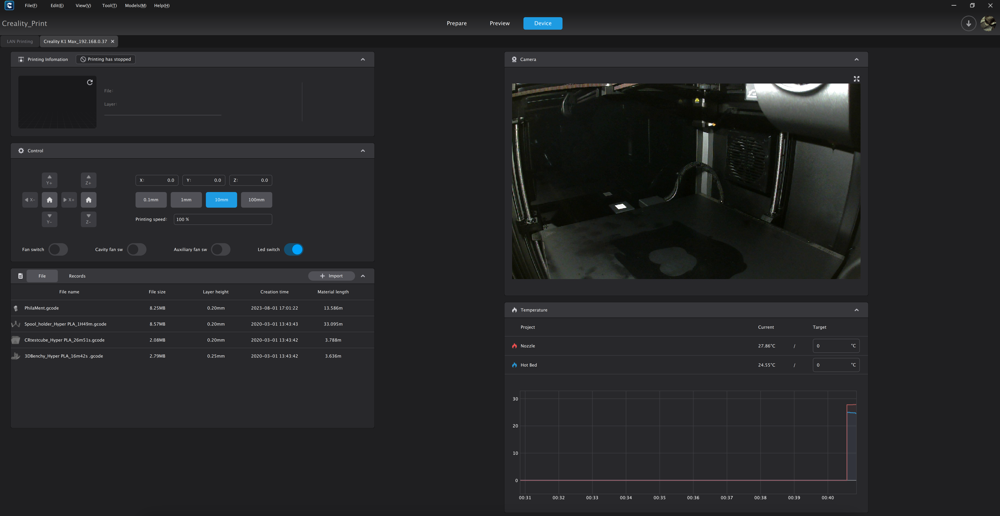

## Creality Web Interface

- To access to the classic **Creality Web Interface**, just use `Creality Print` slicer as usual or just use your printer's IP address in your Web browser such as: 
    `http://xxx.xxx.xxx.xxx` (replacing xxx.xxx.xxx.xxx by your local IP address).

    

## Fluidd Web Interface

- To access to the original **Fluidd Web Interface**, just use your printer's IP address with port **4408** in your Web browser such as: 
    `http://xxx.xxx.xxx.xxx:4408/` (replacing xxx.xxx.xxx.xxx by your local IP address).

    

## Mainsail Web Interface

- To access to the original **Mainsail Web Interface**, just use your printer's IP address with port **4409** in your Web browser such as: 
    `http://xxx.xxx.xxx.xxx:4409/` (replacing xxx.xxx.xxx.xxx by your local IP address).

    

## Alternative

With <a href="../../helper-script/helper-script-installation">Helper Script for Creality</a> you can also remove Creality Web Interface and replace it by Fluidd or Mainsail to use one of them on port 80.

This can be useful in some cases if an application or hardware does not support the IP address with a defined port like the BigTreeTech Knomi V2.

- If you set **Fluidd** as the default Web Interface then it will be accessible with: 
    `http://xxx.xxx.xxx.xxx/` and `http://xxx.xxx.xxx.xxx:4408/`
- If you set **Mainsail** as the default Web Interface then it will be accessible with: 
    `http://xxx.xxx.xxx.xxx/` and `http://xxx.xxx.xxx.xxx:4409/`

    !!! Warning
        **Note that you will no longer be able to print via WiFi with Creality Print if you remove Creality Web Interface (but you can restore it if needed).**

 

**If you like my work, don't hesitate to support me by paying me a 🍺 or a ☕. Thank you 🙂**

