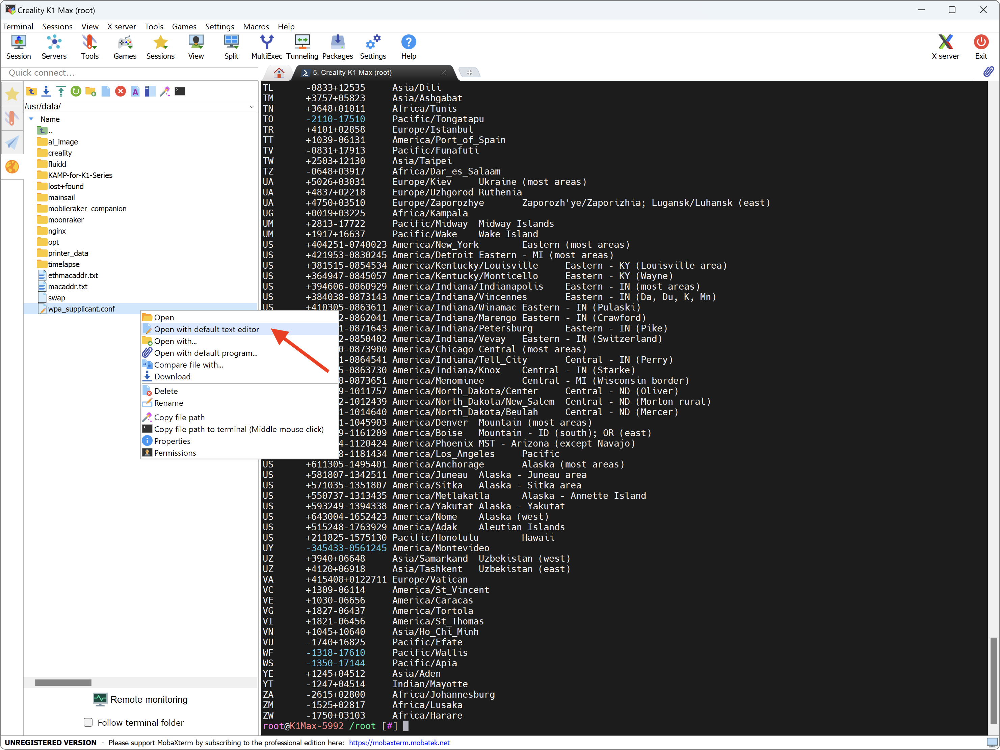
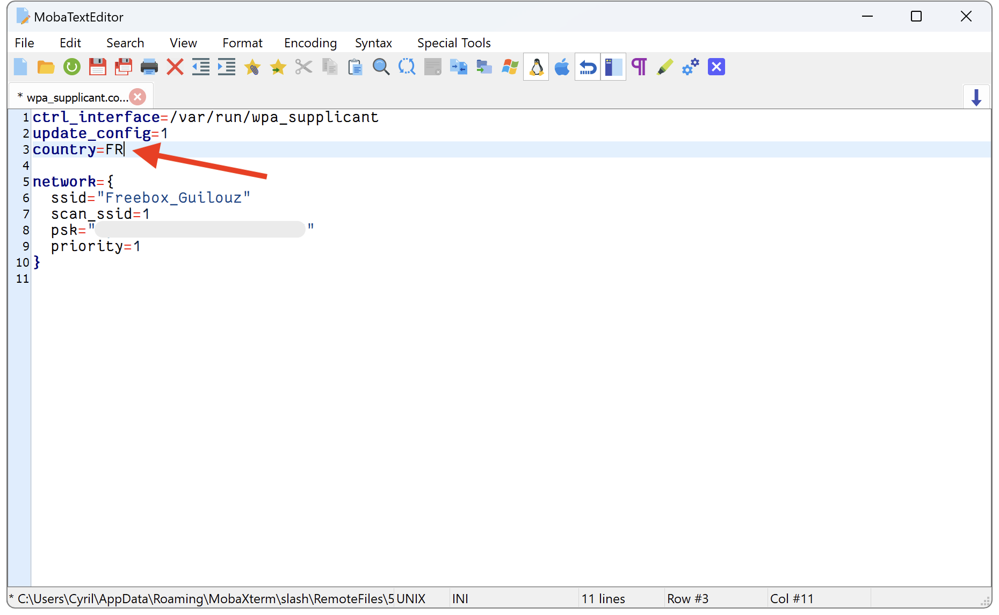
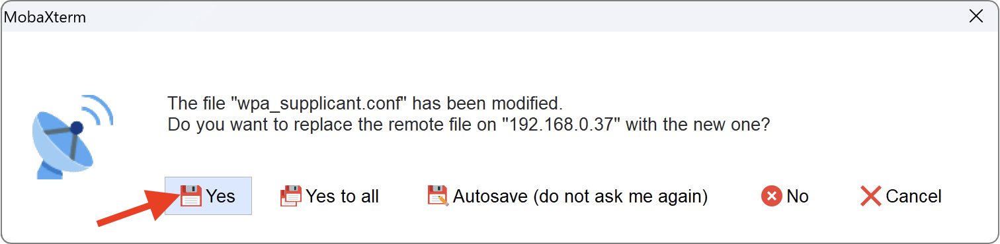

---
hide:
  - toc
---
By default, Wi-Fi location is not set to your own country. Mine is set to GB (Great Britain) while I am in France.

This can be disturbing in some cases because not all countries use the same Wi-Fi frequencies.

Only make these changes if you are experiencing stability issues with your printer's Wi-Fi.

!!! Note
    **This procedure must be repeated after restoring the printer to factory settings or if you update the firmware.**


## Configuration
<hr>

- Connect to SSH (Guide is available <a href="../../firmwares/ssh-connection">here</a>).

- Enter the following command to check all available locations:

    ``` title="SSH Command Prompt"
    cat /usr/share/zoneinfo/zone.tab
    ```

- Locate the two letters specific to your location in the list that appears.

- On the left part of the window, go to the `/usr/data/` folder and right-click on the `wpa_supplicant.conf` file then select `Open with default text editor`:

    

- In the new editing window that appears, modify the country line by replacing the two letters corresponding to your location, like this:

    

- Then click on `Save file` button on the top:

    

- And confirm the file replacement by clicking `Yes` button:

    

- On the right part of the window, in SSH command prompt, enter this command to reboot your printer:

    ``` title="SSH Command Prompt"
    reboot
    ```

- After restarting, the printer's Wi-Fi will be set to your own country.

<br />

**If you like my work, don't hesitate to support me by paying me a 🍺 or a ☕. Thank you 🙂**

<a href="https://ko-fi.com/guilouz" target="_blank"></a>

