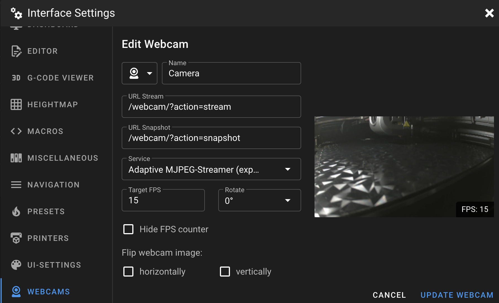

### Configure Camera in Fluidd
<hr>

- When you first go to the original Fluidd Web Interface, the camera will not be detected because it's disabled by default.<br />
  It's necessary to go to `Settings` → `Cameras` and enable it.

- If not working, delete the existing camera and recreate it with these settings:

    

- You can also use this settings (replacing xxx.xxx.xxx.xxx by your local IP address):<br />
    `http://xxx.xxx.xxx.xxx:4408/webcam/?action=stream` for Camera URL Stream<br />
    `http://xxx.xxx.xxx.xxx:4408/webcam/?action=snapshot` for Camera URL Snapshot


### Configure Camera in Mainsail
<hr>

- Go to `Interface Settings` at the top right of the window and in `WEBCAMS` section.

- Configure your webcam like with these settings:

    

- You can also use this settings (replacing xxx.xxx.xxx.xxx by your local IP address):<br />
    `http://xxx.xxx.xxx.xxx:4409/webcam/?action=stream` for Camera URL Stream<br />
    `http://xxx.xxx.xxx.xxx:4409/webcam/?action=snapshot` for Camera URL Snapshot


### Configure Camera in Moonraker
<hr>

!!! Note
    This can also be done from `[Tools] Menu` in <a href="../../helper-script/helper-script-installation">Installation Helper Script</a>.

If you want to configure camera for Fluidd and Mainsail you can also configure it in Moonraker.

-  Open `moonraker.conf` file:

    - On original Fluidd Web Interface go to `Configuration` icon on the left side.
    - On original Mainsail Web Interface go to `Machine` tab on the left side.

- Add this lines (if you don't have them) by replacing `xxx.xxx.xxx.xxx` by your local IP address:

    ```
    [webcam Camera]
    location: printer
    enabled: True
    service: mjpegstreamer
    target_fps: 15
    target_fps_idle: 5
    stream_url: http://xxx.xxx.xxx.xxx:8080/?action=stream
    snapshot_url: http://xxx.xxx.xxx.xxx:8080/?action=snapshot
    flip_horizontal: False
    flip_vertical: False
    rotation: 0
    aspect_ratio: 4:3
    ```

- Then, click on `SAVE & RESTART` button in the top right corner.

- Your camera will be automatically configured for Fluidd and Mainsail.

<br />

**If you like my work, don't hesitate to support me by paying me a 🍺 or a ☕. Thank you 🙂**

<a href="https://ko-fi.com/guilouz" target="_blank"></a>

