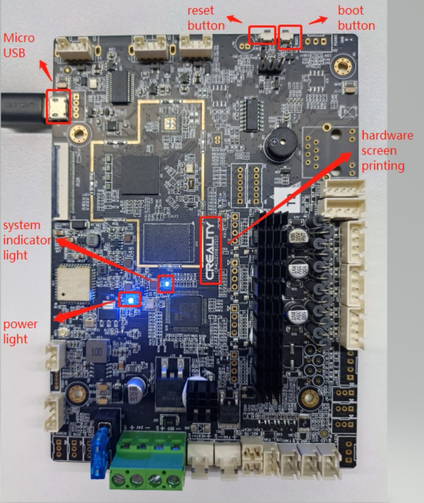
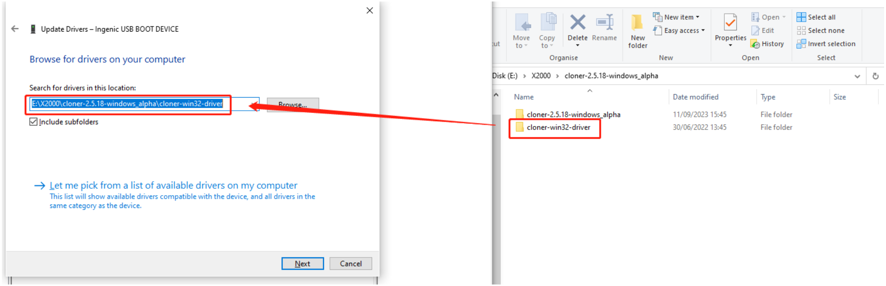
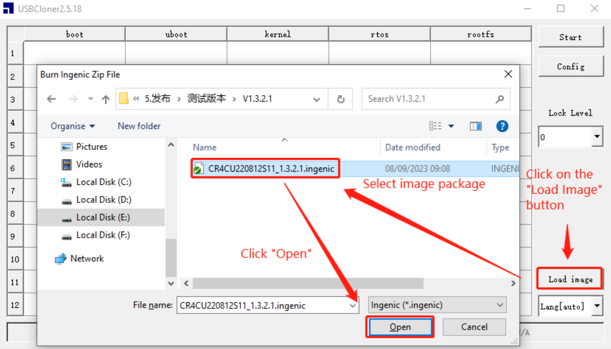
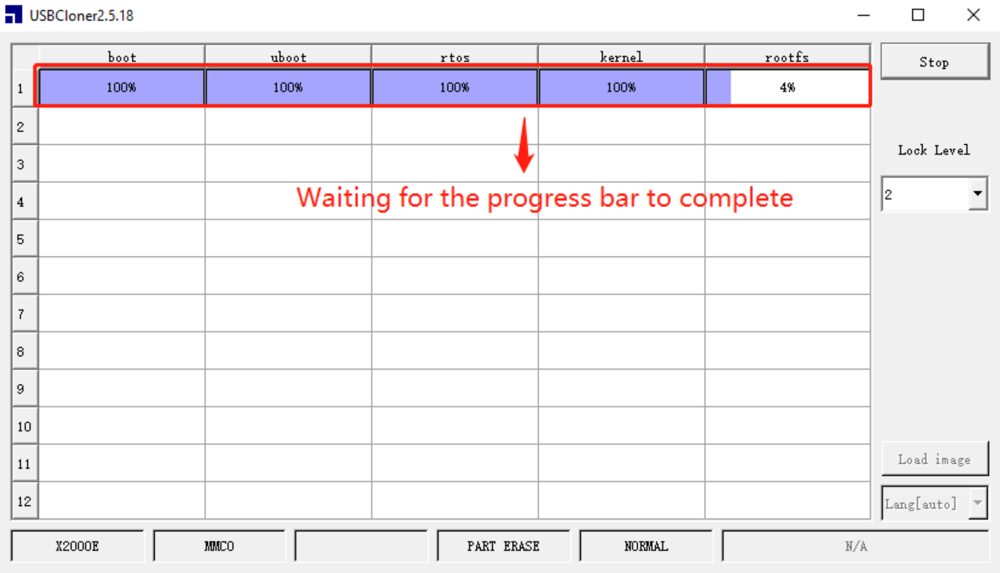
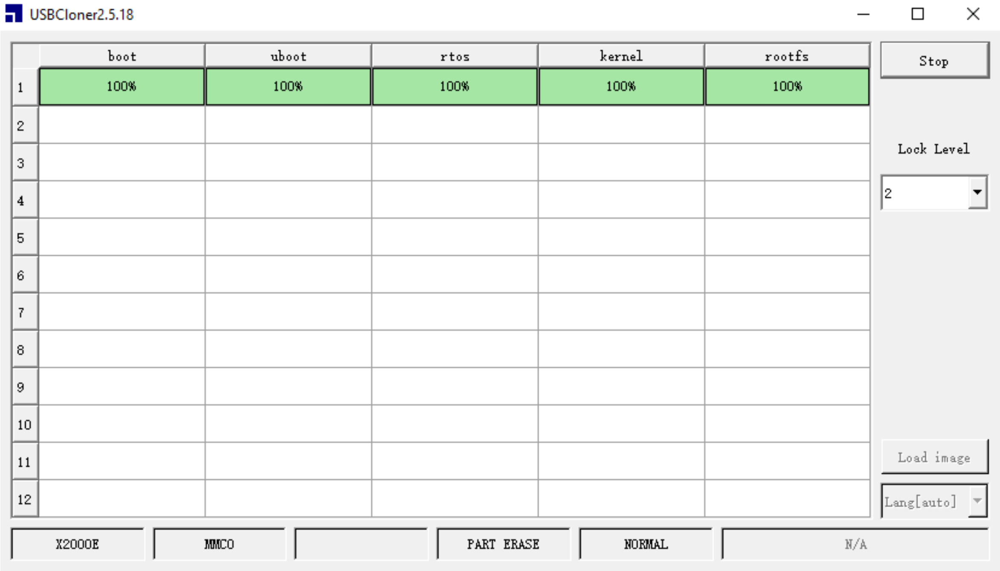

If your motherboard is partially bricked, it's possible to restore the firmware using USB Cloner Tool for the Ingenic SoCs.

## Prerequisites

- USB Cloner Tool and drivers available here: :material-download: [cloner-2.5.36.1-windows_alpha.zip](https://github.com/Guilouz/Creality-Helper-Script-Wiki/raw/main/downloads/Files/cloner-2.5.36.1-windows_alpha.zip)
- A computer running :material-microsoft-windows: Windows
- A microUSB to USB-A cable with dual-purpose for communication and power supply:

    

!!! Note
    **There are two types of microUSB cables:** 
    - With power supply only which does not work for this procedure 
    - With dual-purpose for communication and power supply which work for this procedure

## Recovery Firmwares Download Links

&nbsp;&nbsp;&nbsp;&nbsp;:material-google-drive: [Ingenic 1.3.3.5 (Google Drive)](https://drive.google.com/file/d/163UXd93QuhiuF8tzbv_feymtjGzUkHQa/view?usp=drive_link)

&nbsp;&nbsp;&nbsp;&nbsp;:material-google-drive: [Ingenic 1.3.2.20 (Google Drive)](https://drive.google.com/file/d/1YesxcVkZwoWLtdNBl9FWxLJzfD5xHs3A/view?usp=drive_link)

&nbsp;&nbsp;&nbsp;&nbsp;:material-google-drive: [Ingenic 1.3.2.1 (Google Drive)](https://drive.google.com/file/d/1-VPlPBlk-F7YibHkyWPpIxebhNJX-Gia/view?usp=drive_link)

&nbsp;&nbsp;&nbsp;&nbsp;:material-google-drive: [Ingenic 1.3.0.39 (Google Drive)](https://drive.google.com/file/d/1zlV_gpXGbqq8l_wbcNEygb2r-DPEHV9g/view?usp=drive_link)

## Drivers Installation

- Connect the computer to the motherboard using the microUSB cable.

- Press the `BOOT` button and `RESET` button on the motherboard at the same time:

    

- Then hold them for 3 seconds, release the `RESET` button first, then release the `BOOT` button to enter in boot mode. At this point, the system light should be slightly lit.

- Extract `cloner-2.5.36.1-windows_alpha.zip` file.

- Open **Device Manager** on your computer:

    - Press the `Windows` key to launch the `Windows Start` menu.
    - Type `device manager`
    - Select the `Device Manager` option under the `Best match` section of the search results

- On **Device Manager** window, you should see `Ingenic USB BOOT DEVICE` item with a warning icon in `Other devices` section:

    

  If not, it may be because you are using the first type of microUSB cable, intended only for charging. You need to replace it with the second type of cable.

- Select `Ingenic USB BOOT DEVICE` → Right-click and choose `Update driver`

- Then select `Browse my computer for drivers` → Select the `cloner-win32-driver` folder (from the previously extracted zip file) → Click `Next` button and the system will automatically install the driver:

    

## Flash Firmware

- Run **USB Cloner Tool** by clicking on `cloner.exe` file in `cloner-2.5.36.1-windows_alpha` folder (from the previously extracted zip file).

- Click on the `Load image` button and select the firmware file with **.ingenic** extension:

    

- Enter in boot mode by pressing the `BOOT` button and `RESET` button on the motherboard at the same time. Hold them for 3 seconds, release the `RESET` button first, then release the `BOOT` button.

- Then, click the `Start` button:

    

- At this point, the program will start burning automatically, and you can monitor the burning progress through the progress bar:

    

- After a successful burning, the system indicator light on the mainboard will start blinking intermittently:

    

- The flashing procedure is completed and you have restored the motherboard firmware.

 

**If you like my work, don't hesitate to support me by paying me a 🍺 or a ☕. Thank you 🙂**

