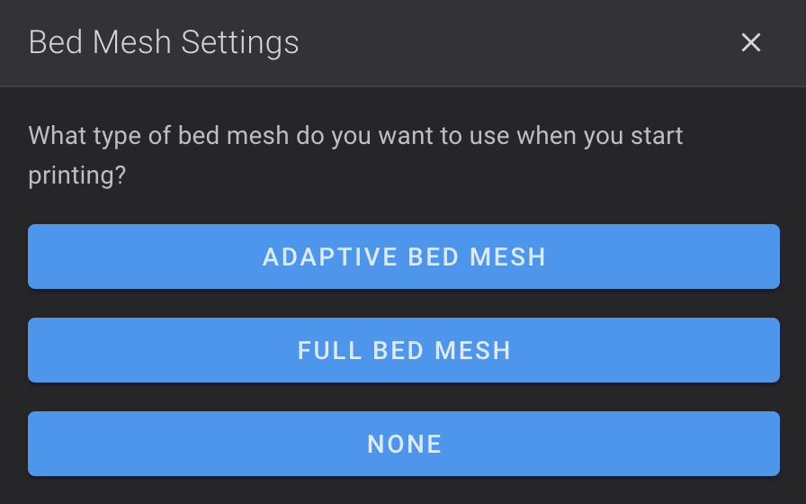

This allows to install Adaptive Bed Meshing (fork of KAMP) modified to works with Ender-3 V3 Series.

Adaptive bed meshing is a way to speed up the bed mesh generation by only probing the area of the bed used by the objects being printed. 
When used, the method will automatically adjust the mesh parameters based on the area occupied by the defined print objects. 

!!! Note
    **This procedure must be repeated after restoring the printer to factory settings.**

## Installation

- Make sure you have followed this <a href="../../helper-script/helper-script-installation">Install Helper Script</a> section before.

- In the script, enter in `[Install] Menu` by typing ++"1"++ , validate with ++"Enter"++ and install `Adaptive Bed Meshing Support`:

    

## Configuration

All settings for Adaptive Bed Meshing are configured by Helper Script, you just need to make sure that `Exclude Objects` setting is enabled in your slicer.

  - **OrcaSlicer**: In `Others` tab, check `Exclude objets` setting
  - **Creality Print**: Under `Parameter Config`, check `Exclude Objects` setting in `Experimental` tab
  - **PrusaSlicer**: Make sure G-code flavor is set to `Klipper` in `Printer Settings > General > Firmware > G-code flavor` and change the `Label Objects` setting to `Firmware-specific` in `Print Settings > Output options > Output file > Label objects`

## Use

To configure the bed mesh type, use the macro `BED_MESH_SETTINGS`:

When `ADAPTIVE BED MESH` is selected, a bed mesh named `adaptive` is done to use adaptative bed mesh when starting a print.

When `FULL BED MESH` is selected, a bed mesh named `default` is done to use adaptative bed mesh when starting a print.

When `NONE` is selected, no bed mesh is performed when starting a print (make sure you have already saved a mesh before).

 

**If you like my work, don't hesitate to support me by paying me a 🍺 or a ☕. Thank you 🙂**

