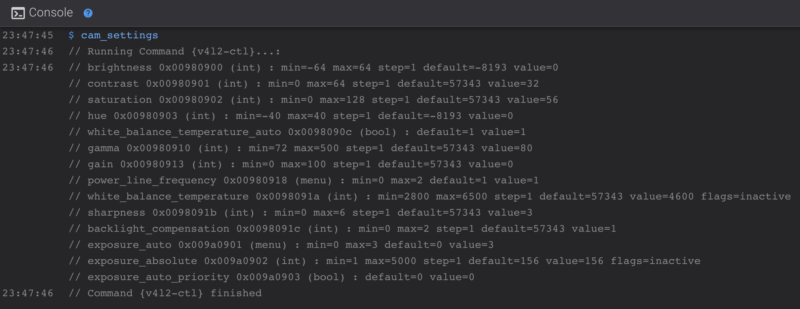

This allows to control camera settings with macros.

!!! Warning
    **This feature is not compatible with the new hardware version of the camera.**

!!! Note
    **This procedure must be repeated after restoring the printer to factory settings.**


## Installation
<hr>

- Make sure you have followed this <a href="../../helper-script/helper-script-installation">Install Helper Script</a> section before.

- In the script, enter in `[Install] Menu` by typing ++"1"++ , validate with ++"Enter"++ and install `Camera Settings Control`:

    


## Use
<hr>

- You can use the different macros starting with `CAM_` to configure your camera settings:

    

    `CAM_SETTINGS` macro can be used to show all current camera settings:

      

- When restarting the printer your camera settings will not be preserved, to correct this open `camera-settings.cfg` located in `Helper-Script` folder and edit this lines with the desired values:

    ``` title="camera-settings.cfg"
    [delayed_gcode LOAD_CAM_SETTINGS]
    initial_duration: 2
    gcode:
      CAM_BRIGHTNESS BRIGHTNESS=0
      CAM_CONTRAST CONTRAST=32
      CAM_SATURATION SATURATION=56
      CAM_HUE HUE=0
      CAM_WHITE_BALANCE_TEMPERATURE_AUTO WHITE_BALANCE_TEMPERATURE_AUTO=1
      CAM_GAMMA GAMMA=80
      CAM_GAIN GAIN=0
      CAM_POWER_LINE_FREQUENCY POWER_LINE_FREQUENCY=1
      CAM_SHARPNESS SHARPNESS=3
      CAM_BACKLIGHT_COMPENSATION BACKLIGHT_COMPENSATION=1
      CAM_EXPOSURE_AUTO EXPOSURE_AUTO=3
      CAM_EXPOSURE_AUTO_PRIORITY EXPOSURE_AUTO_PRIORITY=0
    ```

    !!! Note
        Here all macros are configured with their default value, you can remove unmodified ones if they don't need to be loaded when Klipper starts.

- Then, click on `SAVE AND RESTART` button in the top right corner.

<br />

**If you like my work, don't hesitate to support me by paying me a 🍺 or a ☕. Thank you 🙂**

<a href="https://ko-fi.com/guilouz" target="_blank"></a>
