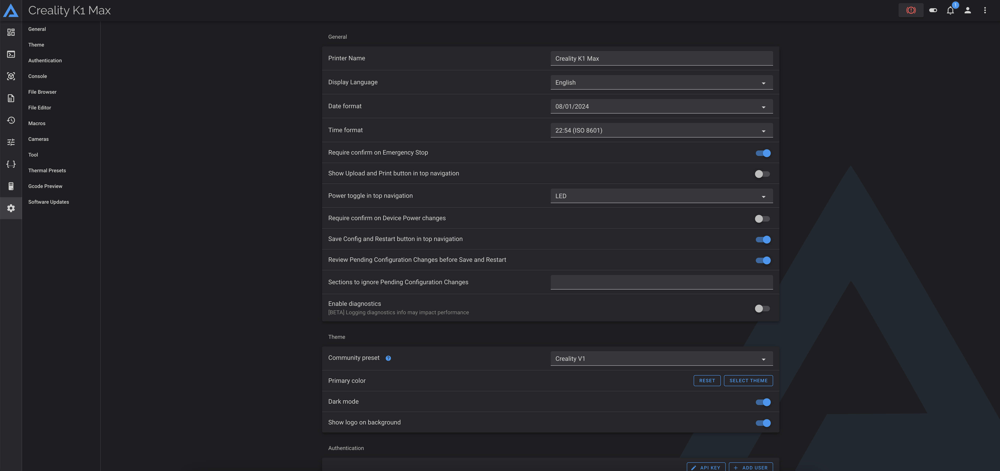

---
hide:
  - toc
---
This allows to have the dynamic Creality logos on the Fluidd Web interface.

!!! Note
    **This procedure must be repeated after restoring the printer to factory settings.**

## Installation

- Make sure you have followed this <a href="../../helper-script/helper-script-installation">Helper Script Installation</a> section before.

- In the script, enter in `[Customize] Menu` by typing ++"3"++ , validate with ++"Enter"++ and install `Creality Dynamic Logos for Fluidd`:

    

- Once installed, you can select Creality V1 or V2 theme in Fluidd settings:

  | Creality V1 |
  | :---------: |
  |  |

  | Creality V2 |
  | :---------: |
  |  |

!!! Note
    **In some cases, it's necessary to clear your web browser's cache to see themes appear.**  

 

**If you like my work, don't hesitate to support me by paying me a 🍺 or a ☕. Thank you 🙂**

