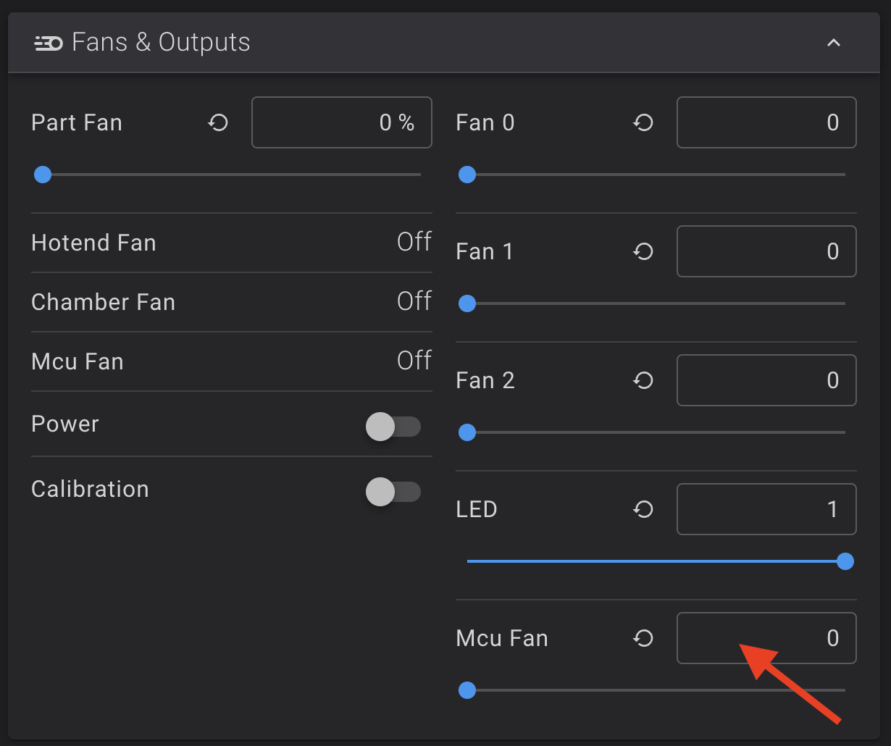
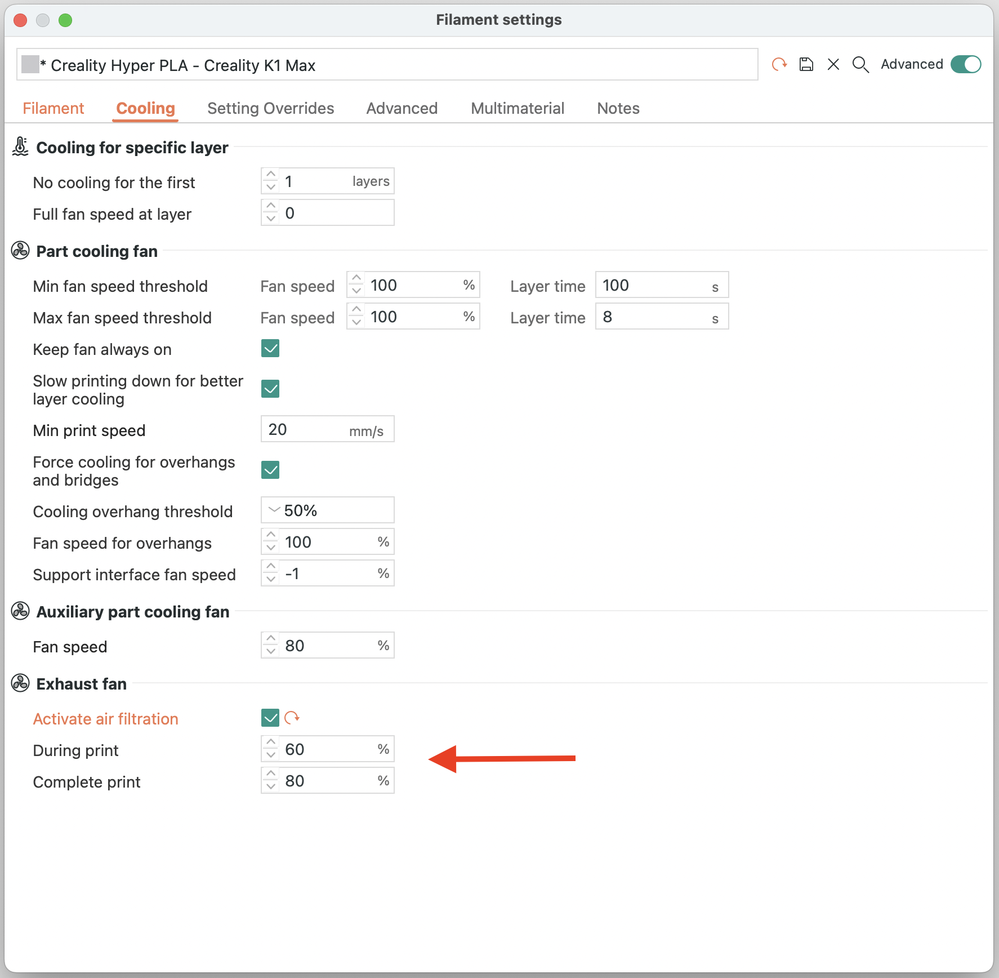

---
hide:
  - toc
---
This allows to trigger the back fan depending on the chamber temperature and the motherboard fan depending on the CPU temperature.

!!! Note
    **This procedure must be repeated after restoring the printer to factory settings.**

## Installation

- Make sure you have followed this <a href="../../helper-script/helper-script-installation">Helper Script Installation</a> section before.

- In the script, enter in `[Install] Menu` by typing ++"1"++ , validate with ++"Enter"++ and install `Fans Control Macros`:

    

- You can now change the trigger temperature of the chamber and motherboard fans here:

    

- You can also change the motherboard fan speed manually here:

    

- You can also use `Print chamber temperature` function in OrcaSlicer with **M141 Sxx** and **M191 Sxx** commands:

    

- You can also use `Exhaust fan` function in OrcaSlicer with **M106 P3 Sxx** command:

    

 

**If you like my work, don't hesitate to support me by paying me a 🍺 or a ☕. Thank you 🙂**

