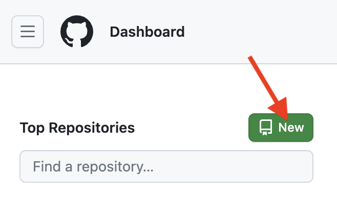
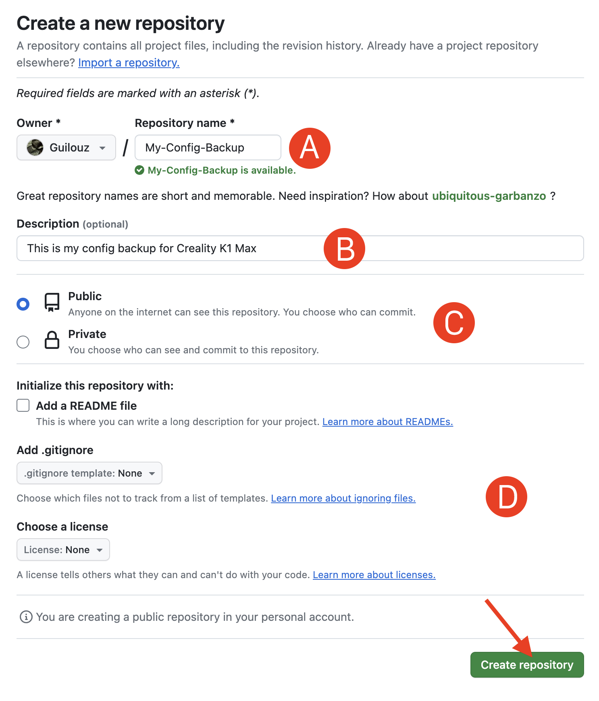
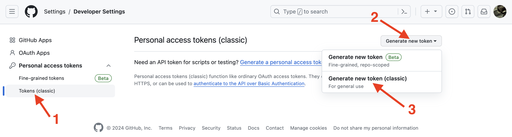
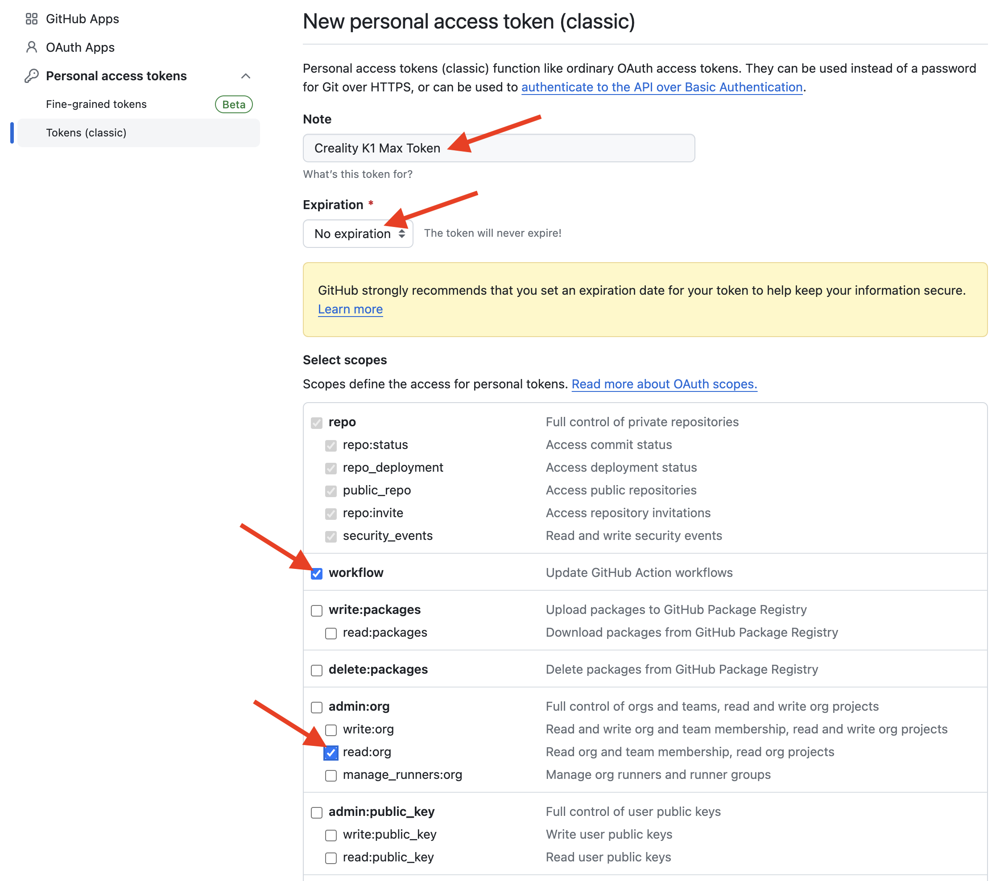
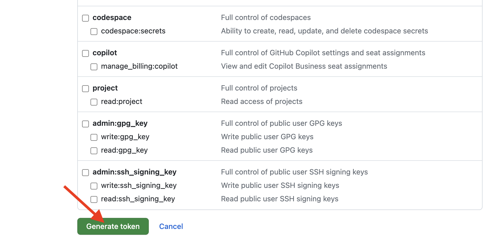
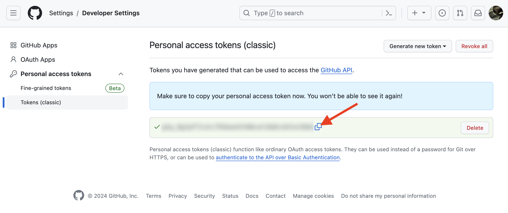

This allows to watch Klipper configuration folder and automatically backup to GitHub whenever a change is made in that directory.

!!! Note
    **This procedure must be repeated after restoring the printer to factory settings.**


## Prerequisites
<hr>

- If you do not have a GitHub account, create one by clicking <a href="https://github.com/signup">here</a> and filling out all the details.

- Sign into your GitHub account.

- Create a new repository by clicking on the `New` button:

    

- Fill in the information for the new repository as follow and click on `Create repository`:

    1. Add a `Repository name`.
    2. The description is optional, but nice to have, especially for others who might view your configurations. 
    3. `Public` or `Private` is up to you.
    4. Make sure `Add a README file` is unchecked, `.gitignore template` is set to `None` and `Licence` is set to `None`.

    

- You now have a new git repository! Next up, it's needed to generate a token that can be used to authenticate against your newly created repository.

- Click <a href="https://github.com/settings/tokens">here</a> to access to your `Personal Access Tokens` settings.

- Make sure `Tokens (classic)` is selected on the leftmost side, then create a new token by clicking on `Generate new token` menu and then on `Generate new token (classic)`:

    
    
    !!! Note
        If you are prompted to reauthenticate, do so. This is a safety measure as you are about to create a sensitive credential.

- Give to your token a meaningful note, set `Expiration` to `No expiration` and check `workflow` and `read:org` boxes:

    

- Then, scroll to the bottom of the page and click on `Generate token`:

    

- You have now a personal access token! Protect it well, like you would any other password!

- Click on the Copy button to copy the token to the clipboard:

    

- I recommend that you copy this token to a text file on your computer because you will not be able to see it again and it will be needed later when installing `Git Backup`.

## Installation
<hr>

- Make sure you have followed this <a href="../../helper-script/helper-script-installation">Helper Script Installation</a> section before.

- In the script, enter in `[Install] Menu` by typing ++"1"++ , validate with ++"Enter"++ and install `Git Backup`:

    

- When asked enter your GitHub username, your repository name and your personal access token retrieved previously.

- Once installed and configured, your Klipper configuration files will be automatically pushed to your GitHub repository.


## Usage
<hr>

- You can control `Git Backup` with this macros:

    - `GIT_BACKUP_STOP` :fontawesome-solid-arrow-right-long: To stop watching Klipper configuration folder and stop pushing to GitHub until manually resumed
    - `GIT_BACKUP_PAUSE` :fontawesome-solid-arrow-right-long: To pause watching Klipper configuration folder and stop pushing to GitHub until next reboot, or until manually resumed
    - `GIT_BACKUP_RESUME` :fontawesome-solid-arrow-right-long: To resume watching Klipper configuration folder and pushing to GitHub

- Git Backup can also be controlled from SSH with this command by replacing `<option>` with possible option:

    ``` title="SSH Command Prompt"
    sh /usr/data/helper-script/files/git-backup/git-backup.sh <option>
    ```

    ``` title="Possible Options"
    -i              Install
    -p              Pause
    -r              Resume
    -s              Stop
    -b branch       Specify branch for git push
    -t target       Specify target directory or file to watch
    -g remote       Specify remote for git push
    ```

<br />

**If you like my work, don't hesitate to support me by paying me a 🍺 or a ☕. Thank you 🙂**

<a href="https://ko-fi.com/guilouz" target="_blank"></a>
