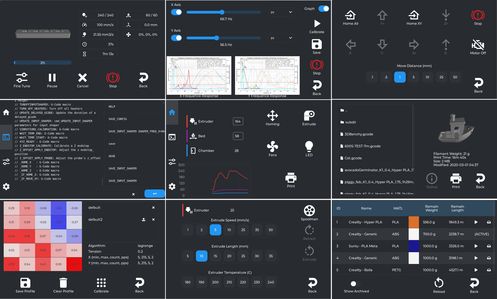

---
hide:
  - toc
---
Guppy Screen is a touch UI for Klipper using APIs exposed by Moonraker. It replace Creality touch UI.

More info about Guppy Screen here: :material-github: [GitHub](https://github.com/ballaswag/guppyscreen)

More info about configuration of Guppy Screen: :material-web: [Here](https://ballaswag.github.io/docs/guppyscreen/configuration/)

!!! Note
    **This procedure must be repeated after restoring the printer to factory settings.**

## Installation

- Make sure you have followed this <a href="../../helper-script/helper-script-installation">Install Helper Script</a> section before.

- In the script, enter in `[Customize] Menu` by typing ++"3"++ , validate with ++"Enter"++ and install `Guppy Screen`:

    

- Once installed, you will have the new screen UI.

- You can update Guppy Screen in screen menu or you can also use `GUPPY_UPDATE` macro.

 

**If you like my work, don't hesitate to support me by paying me a 🍺 or a ☕. Thank you 🙂**

