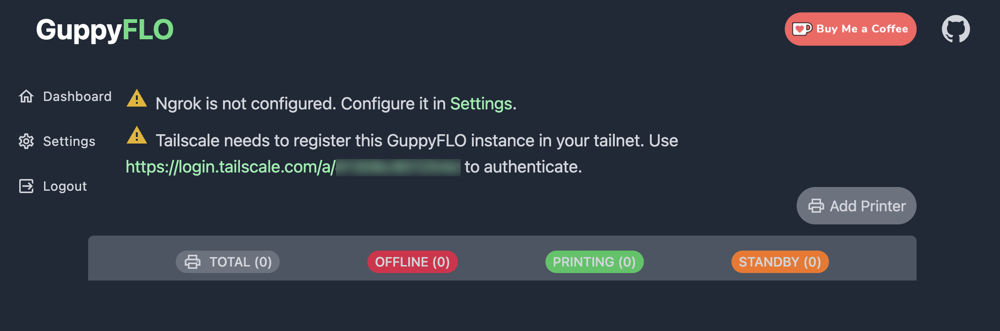
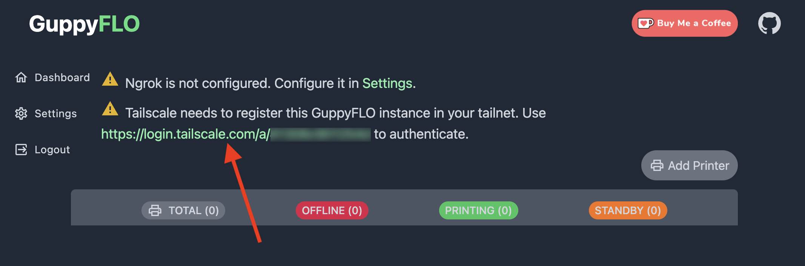
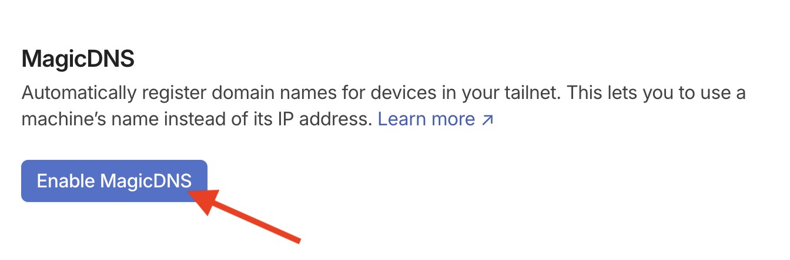
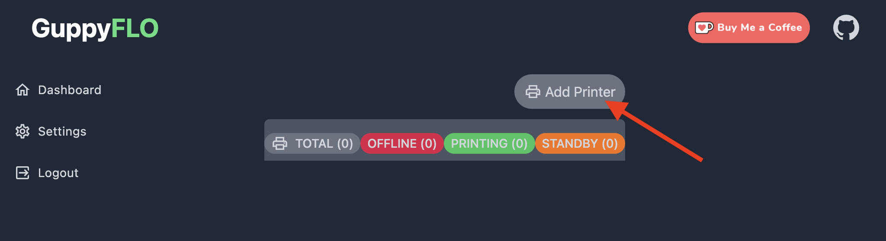
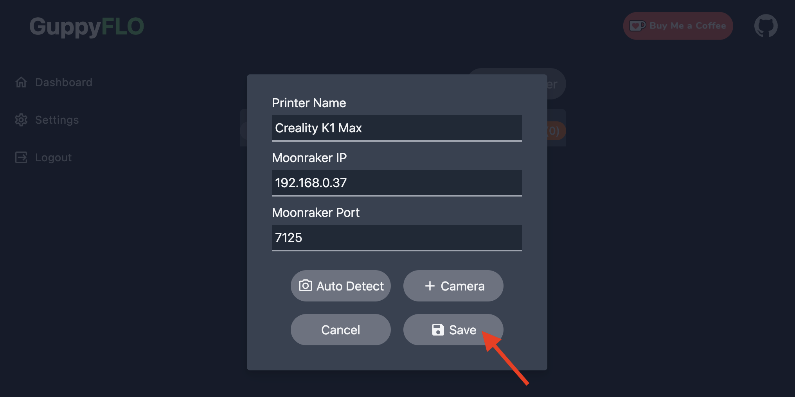

GuppyFLO is a self-hosted service that enables local/remote management of multiple Klipper printers using Moonraker.

More info about GuppyFLO: :material-github: [Here](https://github.com/ballaswag/guppyflo)

More info about Tailscale: :material-web: [Here](https://tailscale.com/)

!!! Note
    **This procedure must be repeated after restoring the printer to factory settings.**

## Installation

- Make sure you have followed this <a href="../../helper-script/helper-script-installation">Helper Script Installation</a> section before.

- In the script, enter in `[Install] Menu` by typing ++"1"++ , validate with ++"Enter"++ and install `GuppyFLO`:

    

## Prerequisites

- Create a free Tailscale account here: :material-web: [Create Tailscale Account](https://login.tailscale.com/start)
 
- Install Tailscale application depending device(s) you want to use for remote access: :material-web: [Download Tailscale App](https://tailscale.com/download)

## Configurations

- Open your web browser and go to the address `http://xxx.xxx.xxx.xxx:9873` (by replacing **xxx.xxx.xxx.xxx** by your printer's local IP address) to access the GuppyFLO Web interface :

    

- Then, click on authenticate link to register GuppyFLO instance to Tailscale:

    

- You will be redirected to the Tailscale website to connect device by clicking on `Connect` button:

    

- Go back to GuppyFLO Web interface and click on `Add Printer` button:

    

- Configure settings and click on `Add Printer` button:

    

- Go to to your Tailscale Admin console here: :material-web: [Tailscale Admin Console](https://login.tailscale.com/admin/machines)

- There you will see the connected devices and their respective IP addresses :

    

    1. guppyflo :fontawesome-solid-arrow-right-long: Your printer
    2. IP address assigned to your printer (to connect to it remotely)
    3. The devices you have connected to Tailscale (here my mobile phone)
    4. The IP addresses assigned to the devices you have connected

 

    What interests us here is the IP address assigned to guppyflo (your printer). It's this IP address that you will need to use to connect to the GuppyFlo Web interface remotely from the device(s) you have connected to Tailscale.

- You can now connect to GuppyFlo Web interface remotely by using IP address assigned to guppyflo:

    

!!! Note
    **For now camera not working remotely and it will be fixed in future release of GuppyFLO.**

 

**If you like my work, don't hesitate to support me by paying me a 🍺 or a ☕. Thank you 🙂**

