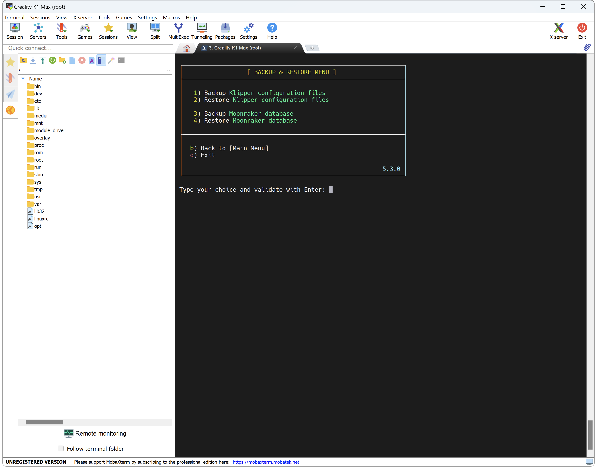
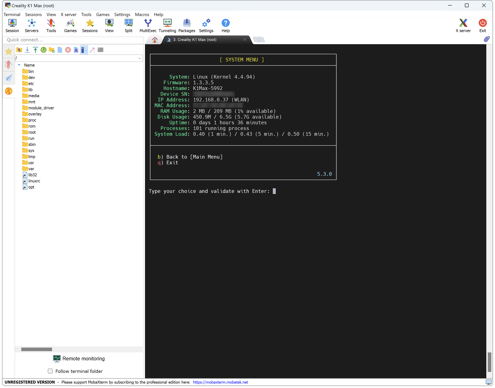
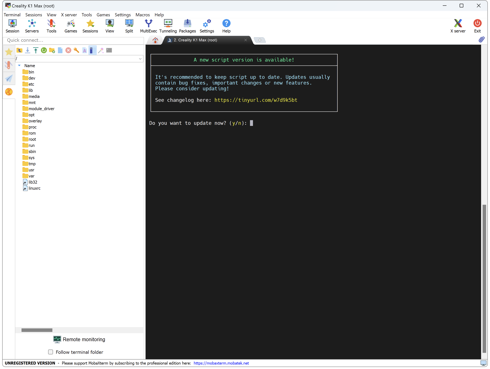

Helper Script allows to install latest official builds and many useful features.

It's completely automated, necessary changes are made automatically when installing a feature and restored after uninstallation.

When the script is updated, installed files are automatically updated as well.

!!! Warning
    **FOR K1 SERIES: ONLY USE THIS SCRIPT WITH FIRMWARE 1.3.3.5 AND ABOVE!<br />
    FOR KE SERIES: ONLY USE THIS SCRIPT WITH FIRMWARE 1.1.0.12 AND ABOVE!**

!!! Note
    **Please restore firmware to factory settings before using script to avoid issue.**<br />
    See: <a href="../../firmwares/reset-factory-settings">Reset Factory Settings</a> section.

## Installation
<hr>

If you have already installed Moonraker, Fluidd or Mainsail provided by Creality, please uninstall them first using `[Remove] Menu`.

- Connect to SSH (Guide is available <a href="../../firmwares/ssh-connection">here</a>).

- Enter the following command to install script in `usr/data` folder:

    ``` title="SSH Command Prompt"
    git clone https://github.com/Guilouz/Creality-Helper-Script.git /usr/data/helper-script
    ```

- And enter this command to run the script:

    ``` title="SSH Command Prompt"
    sh /usr/data/helper-script/helper.sh
    ```

<br />

- If you encounter an issue to clone Helper Script repository, enter this command before cloning:

    ``` title="SSH Command Prompt"
    git config --global http.sslVerify false
    ```

- Also, make sure your system date and time are correct. You can check this with the command:

    ``` title="SSH Command Prompt"
    date
    ```

- To change the date and time use the following command in this format:

    ``` title="SSH Command Prompt"
    date -s "YYYY-MM-DD HH:MM:SS"
    ```

!!! Note
    Some features are not available for KE Series.


## Main Menu
<hr>

This is the main menu:


## Install Menu
<hr>

This menu allows you to install various useful features:


## Remove Menu
<hr>

This menu allows you to remove installed features:


## Customize Menu
<hr>

This menu allows you to customize your printer:


## Backup & Restore Menu
<hr>

This menu allows you to backup and restore your configuration files:




## Tools Menu
<hr>

This menu allows you to perform different actions:


## Informations Menu
<hr>

This menu allows you to know what is installed or not on the printer:


## System Menu
<hr>

This menu allows you to have different information about the printer:




## Update Screen
<hr>

This is the update screen:



<br />

**If you like my work, don't hesitate to support me by paying me a 🍺 or a ☕. Thank you 🙂**

<a href="https://ko-fi.com/guilouz" target="_blank"></a>
