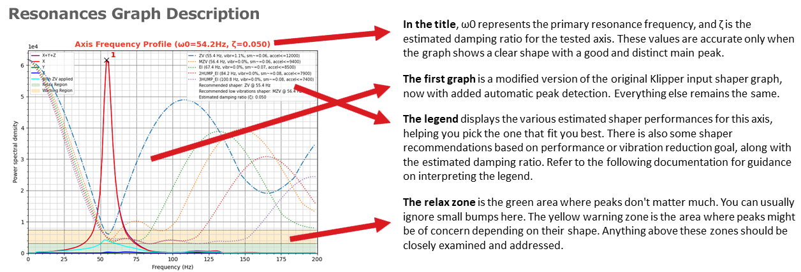

This allows to install many macros to calculate Input Shaper, perform different analyzes on vibrations and belts and restore all shapers.

Creality has blocked the Input Shaper results on the `ei` shaper with `AUTOTUNE_SHAPERS` macro in latest firmwares.

This means that the `ei` shaper will always be selected by default.

Furthermore, the resonances of the X axis are never measured.
The resonance test is performed on the Y axis and the same result is also applied on the X axis.

!!! Note
    **This procedure must be repeated after restoring the printer to factory settings.**

## Installation

!!! Note
    You can't install `Improved Shapers Calibrations` if you already have installed `Guppy Screen` because it already has these features.

- Make sure you have followed this <a href="../../helper-script/helper-script-installation">Install Helper Script</a> section before.

- In the script, enter in `[Install] Menu` by typing ++"1"++ , validate with ++"Enter"++ and install `Improved Shapers Calibrations`:

    

- Run `INPUT_SHAPER_CALIBRATION` macro to measure the X and Y axis resonances and save results in printer.cfg file.

## Extras

- You can test X and Y axis resonances and generate graphs by running `TEST_RESONANCES_GRAPHS` macro (or `GUPPY_SHAPERS` macro with Guppy Screen). More info :material-github: [here](https://github.com/Frix-x/klippain-shaketune/blob/main/docs/macros/axis_tuning.md).

    

- You can perform a custom half-axis test to analyze and compare the frequency profiles of individual belts by running `BELTS_SHAPER_CALIBRATION` macro (or `GUPPY_BELTS_SHAPER_CALIBRATION` macro with Guppy Screen). More info :material-github: [here](https://github.com/Frix-x/klippain-shaketune/blob/main/docs/macros/belts_tuning.md).

    

- You can maintain a specified excitation frequency for a period of time to diagnose and locate a vibration source by running `EXCITATE_AXIS_AT_FREQ` macro.

 

**If you like my work, don't hesitate to support me by paying me a 🍺 or a ☕. Thank you 🙂**

