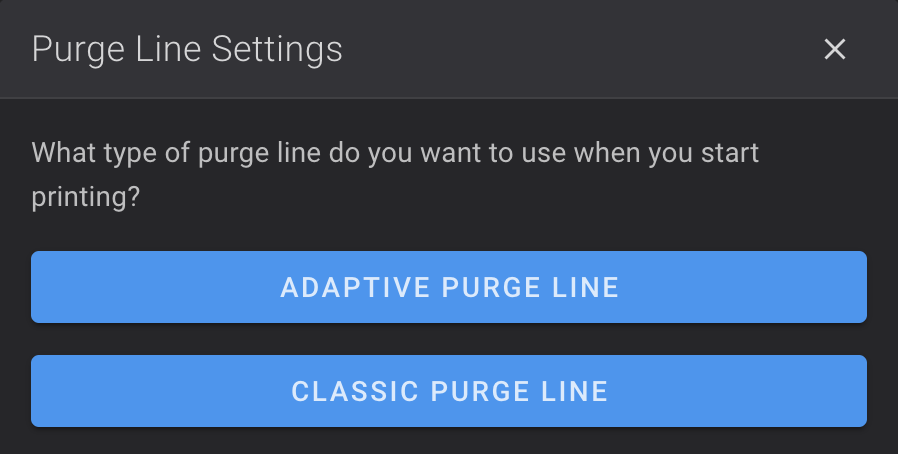

This allows to install Klipper Adaptive Meshing & Purging modified build to works with K1 Series and Ender-3 V3 Series.

Klipper Adaptive Meshing & Purging is an extension that allows you to generate a mesh and purge line only in the area of the bed used by the objects being printed. 
When used, the method will automatically adjust the mesh parameters based on the area occupied by the defined print objects.

More info about KAMP here: :material-github: [GitHub](https://github.com/kyleisah/Klipper-Adaptive-Meshing-Purging)

!!! Note
    **This procedure must be repeated after restoring the printer to factory settings.**

## Installation

- Make sure you have followed this <a href="../../helper-script/helper-script-installation">Install Helper Script</a> section before.

- In the script, enter in `[Install] Menu` by typing ++"1"++ , validate with ++"Enter"++ and install `Klipper Adaptive Meshing & Purging`:

    

## Configuration

All settings for KAMP are configured by Helper Script, you just need to make sure that `Exclude Objects` setting is enabled in your slicer.

  - **OrcaSlicer**: In `Others` tab, check `Exclude objets` setting
  - **Creality Print**: Under `Parameter Config`, check `Exclude Objects` setting in `Experimental` tab
  - **PrusaSlicer**: Make sure G-code flavor is set to `Klipper` in `Printer Settings > General > Firmware > G-code flavor` and change the `Label Objects` setting to `Firmware-specific` in `Print Settings > Output options > Output file > Label objects`

## Use

- To configure the bed mesh type, use the `BED_MESH_SETTINGS` macro:

    

    - When `ADAPTIVE BED MESH` is selected, a bed mesh named `adaptive` is done to use adaptative bed mesh when starting a print.

    - When `FULL BED MESH` is selected, a bed mesh named `default` is done to use adaptative bed mesh when starting a print.

    - When `NONE` is selected, no bed mesh is performed when starting a print (make sure you have already saved a mesh before).

- To configure the purge line type, use the `PURGE_LINE_SETTINGS` macro:

    

    - When `ADAPTIVE PUGE LINE` is selected, a adaptive purge line near the print area is done when starting a print.

    - When `CLASSIC PURGE LINE` is selected, a classic purge line is done when starting a print.

!!! Note
    Adaptative Bed Mesh and Adaptive Purge Line are loaded by default every time Klipper starts.

 

**If you like my work, don't hesitate to support me by paying me a 🍺 or a ☕. Thank you 🙂**

