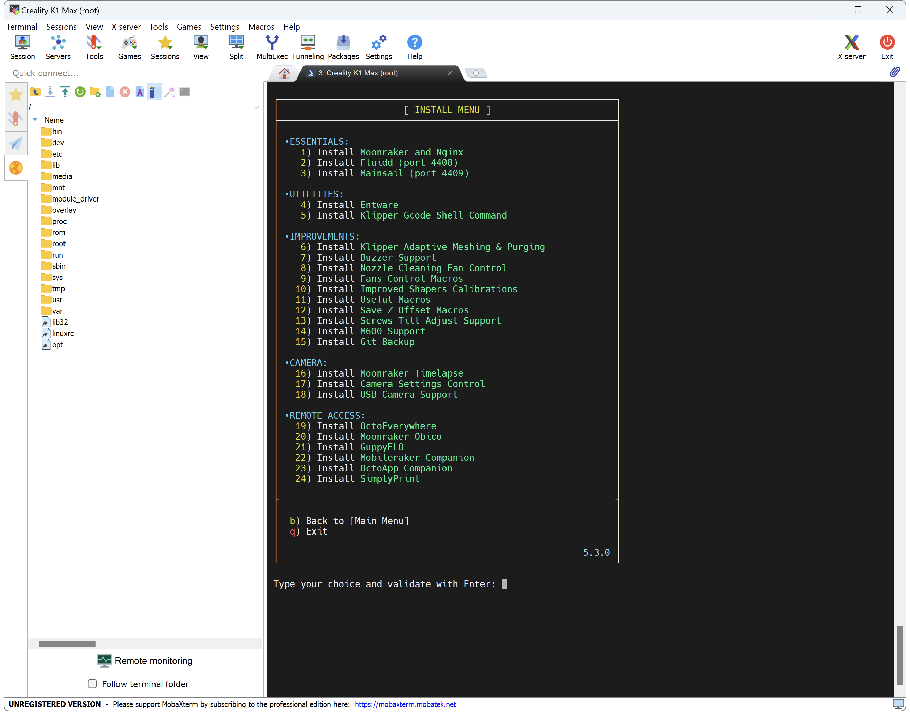

This allows to use `M600` command in your slicer to change filament.

!!! Note
    **This procedure must be repeated after restoring the printer to factory settings.**

!!! Note
    This feature is not available for KE Series.

## Installation

- Make sure you have followed this <a href="../../helper-script/helper-script-installation">Helper Script Installation</a> section before.

- In the script, enter in `[Install] Menu` by typing ++"1"++ , validate with ++"Enter"++ and install `M600 Support`:

    

- You can now use `M600` command in your Slicer to trigger a filament change.

## How M600 works

Unlike a classic pause which just parks the hotend on the right side and does not stop hotend heater and part fan, `M600` command works as follows:

  - When an M600 is detected in Gcode or if filament runout sensor is triggered, the hotend is parked at the front right of the build plate
  - Filament is ejected from the hotend and fans are stopped
  - At this stage user action is required. If no action is done, the heating of the hotend is stopped after 15 min to avoid thermal runaway
  - User must remove old filament and replace the new one by placing it at the extruder inlet and press the `Resume` button
  - The hotend returns to its original temperature and the fans reactivate to their original state
  - The filament is reinserted into the hotend and a purge is performed before printing resumes
    
    !!! Note
        **Remember to remove excess purge from the hotend before resuming printing.**

 

**If you like my work, don't hesitate to support me by paying me a 🍺 or a ☕. Thank you 🙂**

