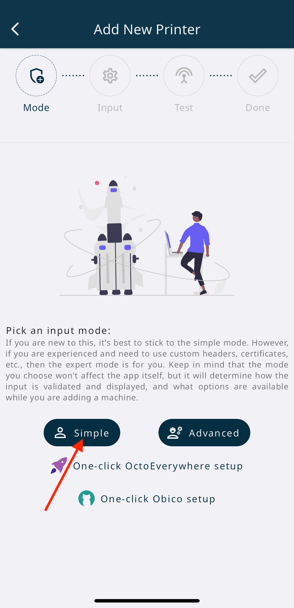
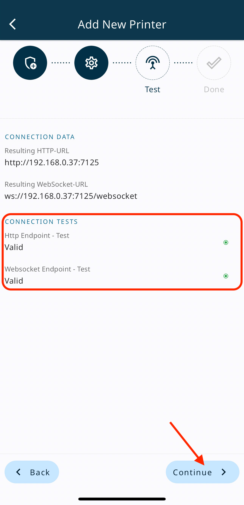
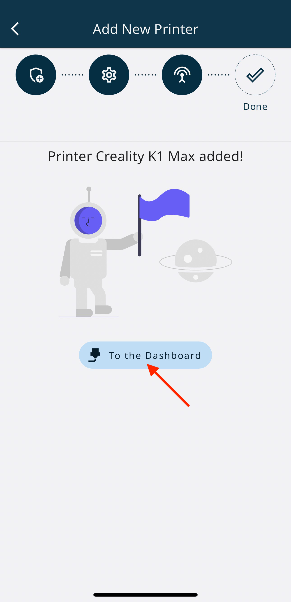
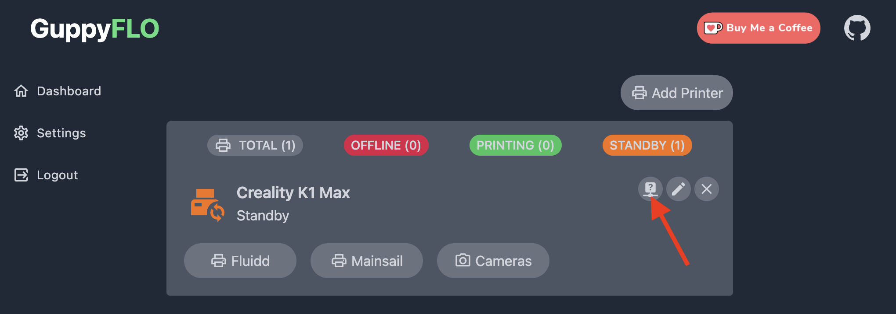
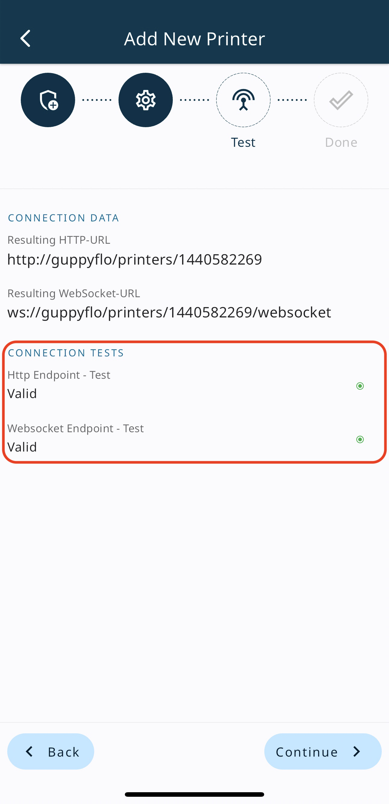
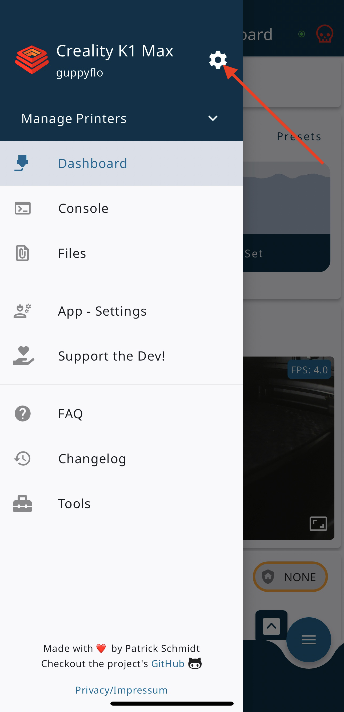
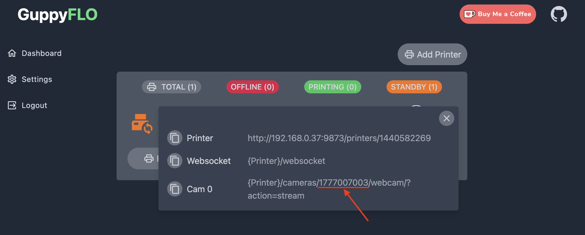
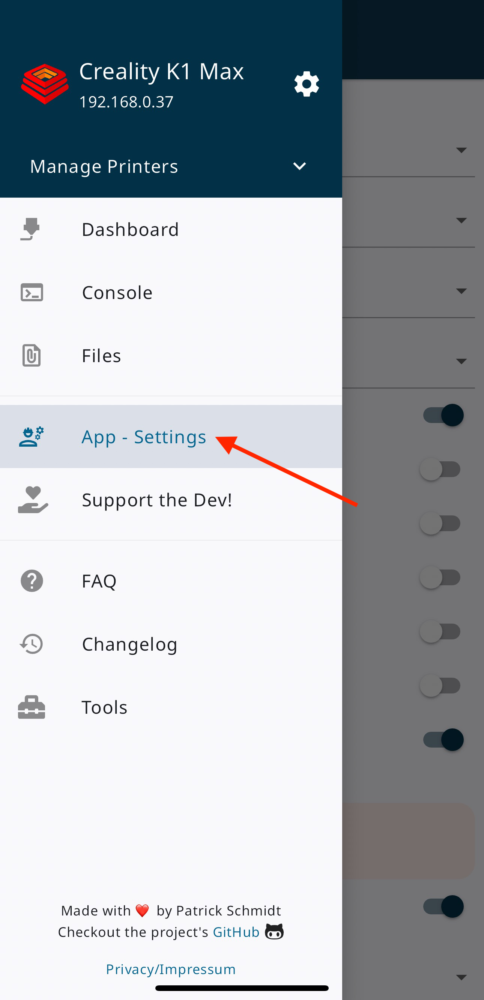
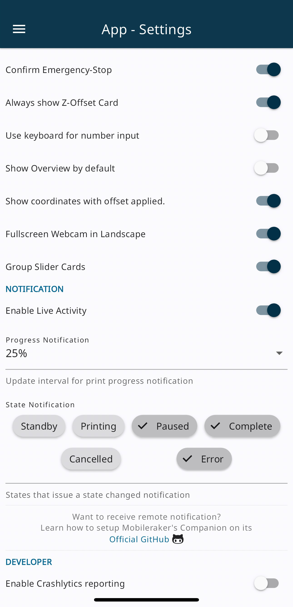
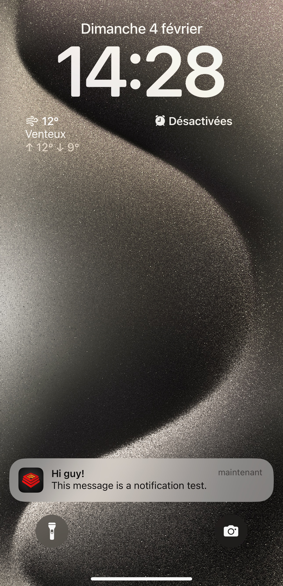

Mobileraker Companion allows to push notification for Klipper using Moonraker for Mobileraker phone App.

More info about Mobileraker Companion: :material-github: [Here](https://github.com/Clon1998/mobileraker_companion)

More info about Mobileraker: :material-web: [Here](https://mobileraker.com/)

!!! Note
    **This procedure must be repeated after restoring the printer to factory settings.**


## Installation
<hr>

- Make sure you have followed this <a href="../../helper-script/helper-script-installation">Install Helper Script</a> section before.

- In the script, enter in `[Install] Menu` by typing ++"1"++ , validate with ++"Enter"++ and install `Mobileraker Companion`:

    


## Download Mobileraker App
<hr>

<a href="https://play.google.com/store/apps/details?id=com.mobileraker.android"></a>&nbsp;&nbsp;&nbsp;&nbsp;&nbsp;&nbsp;&nbsp;&nbsp;
<a href="https://apps.apple.com/us/app/mobileraker/id1581451248"></a>


## Add Printer (Local Access)
<hr>

- Start **Mobileraker** App and click on `Add Machine`:

    

- Then, click on `Simple`:

    

- Configure this settings like that by replacing **xxx.xxx.xxx.xxx** by your printer's local IP address and click on `Test Connection`:

    

- If your configuration is correct, the test should return `Valid` status and you can click on `Continue`:

    

- Then, you can click on `To the Dashboard`:

    

- Your printer is now added to Mobileraker for local access.


## Add Printer (Remote Access with GuppyFLO)
<hr>

- <a href="../guppyflo.md">GuppyFLO</a> is needed for remote access, please follow installation.

- Start **Mobileraker** App and click on `Add Machine`:

    

- Then, click on `Advanced`:

    

- Configure this settings like that by replacing `Printer` and `Websocket` adresses by yours and click on `Test Connection`:

    
    
    Your **Printer Adress** must be similar to:<br />
    `http://guppyflo/printer/xxxxxxxxxx`<br />
    by replacing `xxxxxxxxxx` by your Printer ID
    
    Your **Websocket Adress** must be similar to:<br />
    `ws://guppyflo/printer/xxxxxxxxxx/websocket`
    <br />by replacing `xxxxxxxxxx` by your Printer ID

    You can obtain your **Printer ID** by clicking on the `Info` button on GuppyFLO Web interface:

    

    

- If your configuration is correct, the test should return `Valid` status and you can click on `Continue`:

    

- Then, you can click on `To the Dashboard`:

    

- Your printer is now added to Mobileraker for remote access.

- To configure camera, click on the 3 horizontal bars to display the menu:

    

- Click on `Settings` icon:

    

- And edit `WEBCAM` section:

    

    Your **Stream URL** must be similar to:<br />
    `http://guppyflo/printer/xxxxxxxxxx/cameras/yyyyyyyyyy/webcam/?action=stream`<br />
    by replacing `xxxxxxxxxx` by your Printer ID and `yyyyyyyyyy` by your Camera ID

    Your **Snapshot URL** must be similar to:<br />
    `http://guppyflo/printer/xxxxxxxxxx/cameras/yyyyyyyyyy/webcam/?action=snapshot`<br />
    by replacing `xxxxxxxxxx` by your Printer ID and `yyyyyyyyyy` by your Camera ID

    You can obtain your **Camera ID** by clicking on the `Info` button on GuppyFLO Web interface:

    

    

!!! Note
    **The camera works remotely only when configured on the Fluidd or Mainsail Web interface. See the [Configure Camera](../configurations/configure-camera.md) section.**


## Configurations
<hr>

- Click on the 3 horizontal bars to display the menu:

    

- Click on `App Settings` to display application settings:

    

- In the **NOTIFICATION** section, you will see a warning, click on it and authorize the application notifications:

    

- You can now configure App settings like that:

    

- You can now test push notifications by enter this command in Console on Fluidd or Mainsail Web interface:

     ``` title="Console"
     M117 $MR$:Hi guy!|This message is a notification test.
     ```

- And you should receive this notification:

    

- Mobileraker can send push notifications when your printer is in the following state: `Standby`,`Printing`,`Paused`,`Canceled`,`Complete` and `Error`


## Use Push Notification in macros
<hr>

- Open `gcode_macro.cfg` file:

  - On original Fluidd Web Interface go to `Configuration` icon on the left side.
  - On original Mainsail Web Interface go to `Machine` tab on the left side.

- And add this macro:

    ``` title="gcode_macro.cfg"
    [gcode_macro MR_NOTIFY]
    description: Allows to send custom notifications via Mobileraker without using the M117 command
    gcode:
      
      
        { action_respond_info(msg) }
      
        { action_raise_error('Must provide MESSAGE parameter') }
      
    ```

- Then, click on `SAVE & RESTART` button in the top right corner.

- You can now use command in this format where you want in your macros to send push notifications:

    ```
    MR_NOTIFY TITLE="your_title" MESSAGE="your_message"
    ```

- When crafting your custom notification's title or message, you have the flexibility to incorporate placeholders that will be dynamically replaced by the Mobileraker Companion. These placeholders allow you to convey specific information relevant to the notification.

    !!! Example
        **Usage**: `MR_NOTIFY TITLE="I am $printer_name" MESSAGE="$file is currently printing!"`

- Below is a list of available placeholders and their corresponding replacements:


    | Placeholder Key       | Description                                                                                                                                                      | Condition                                                                  |
    | --------------------- | ---------------------------------------------------------------------------------------------------------------------------------------------------------------- | -------------------------------------------------------------------------- |
    | `$printer_name`       | The name of the printer set in Mobileraker app                                                                                                                   | Can always be used                                                         |
    | `$file`               | The file that is currently printing                                                                                                                              | Only available while the printer is in state printing, paused or completed |
    | `$eta`                | The eta of the current print job in the timezone defined through the config file. Date-Format corresponds to the provided `eta_format` in the config             | Only available during printing or paused                                   |
    | `$a_eta`              | In contrast to `$eta`, the adaptive eta returns the eta timestamp if the print ends on the current day, else it returns the date timestamp as the normal eta     | Only available during printing or paused                                   |
    | `$remaining_avg`      | The avg remaining time for the current print job. Combining all availables sources for the remaining time (File-Position, Filament, Slicer) (Format: days HH:MM) | Only available during printing or paused                                   |
    | `$remaining_file`     | The remaining time for the current print job using the File-Position as source (Format: days HH:MM)                                                              | Only available during printing or paused                                   |
    | `$remaining_filament` | The remaining time for the current print job using the total and used filament as source (Format: days HH:MM)                                                    | Only available during printing or paused                                   |
    | `$remaining_slicer`   | The remaining time for the current print job using the Slicer data as source (Format: days HH:MM)                                                                | Only available during printing or paused                                   |
    | `$progress`           | The printing progress (0-100)                                                                                                                                    | Only available during printing or paused                                   |
    | `$cur_layer`          | The current layer                                                                                                                                                | Only available during printing or paused                                   |
    | `$max_layer`          | The maximum layer of the file that is currently beeing printed                                                                                                   | Only available during printing or paused                                   |

<br />

**If you like my work, don't hesitate to support me by paying me a 🍺 or a ☕. Thank you 🙂**

<a href="https://ko-fi.com/guilouz" target="_blank"></a>
