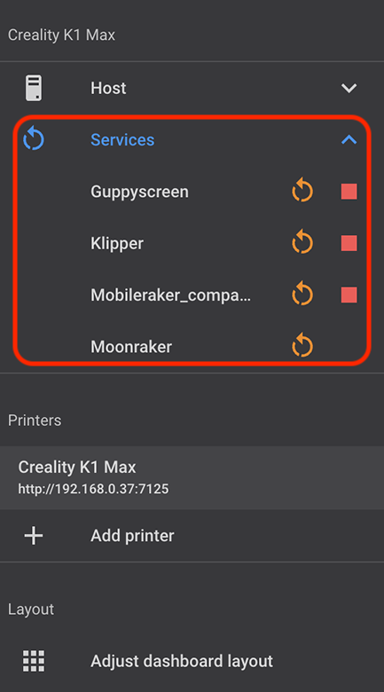
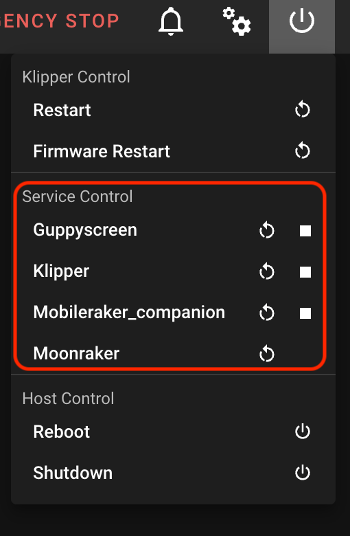
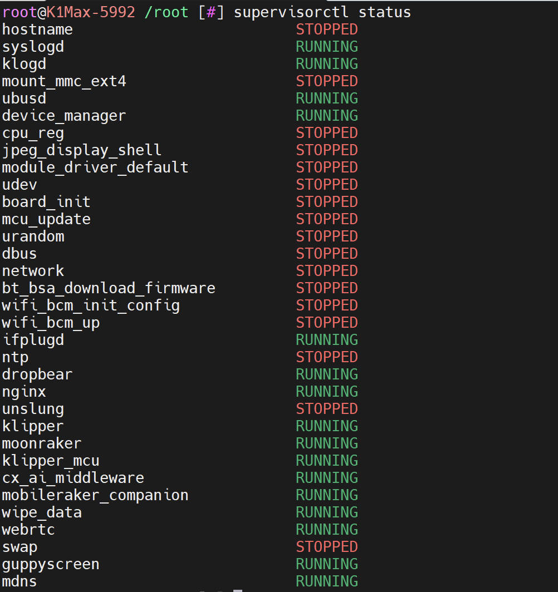
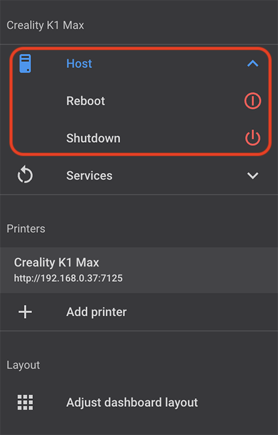
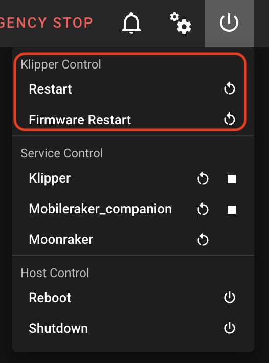

This allows to install official and latest build of Moonraker.

Moonraker is a Python 3 based web server that exposes APIs with which client applications may use to interact with Klipper firmware.

Note that Moonraker does not come bundled with a client, you will need to install one. The following clients are currently available:

  - <a href="../fluidd">Fluidd</a> by <a href="https://github.com/fluidd-core">Fluidd Crew</a>
  - <a href="../mainsail">Mainsail</a> by <a href="https://github.com/mainsail-crew">Mainsail Crew</a>

!!! Note
    **This procedure must be repeated after restoring the printer to factory settings.**


## Installation
<hr>

- Make sure you have followed this <a href="../../helper-script/helper-script-installation">Install Helper Script</a> section before.

- In the script, enter in `[Install] Menu` by typing ++"1"++ , validate with ++"Enter"++ and install `Updated Moonraker`:

    

    !!! Note
        You can update Moonraker with Update Manager in Fluidd or Mainsail Web interface when a new version is available.


## Supervisor Lite
<hr>

When installing Updated Moonraker, Supervisor Lite is also installed.

It allows to manage services with Moonraker.

- You can restart and stop service with Moonraker in Update Manager or on Web interfaces:

    | Fluidd | Mainsail |
    | :---------: | :---------: |
    |  |  |

- It can be also used in SSH with this command:

    ``` title="SSH Command Prompt"
    /usr/bin/supervisorctl [command] <service>
    ```

    **Commands include:** `status` `stop` `start` `restart`

    


## Host Control Support
<hr>

When installing Updated Moonraker, Host Control Support is also installed. This allows to use Reboot and Shutdown buttons on Fluidd or Mainsail. By default they are not working.

- You can restart and stop host on Web interfaces:

    | Fluidd | Mainsail |
    | :---------: | :---------: |
    |  |  |

<br />

**If you like my work, don't hesitate to support me by paying me a 🍺 or a ☕. Thank you 🙂**

<a href="https://ko-fi.com/guilouz" target="_blank"></a>
