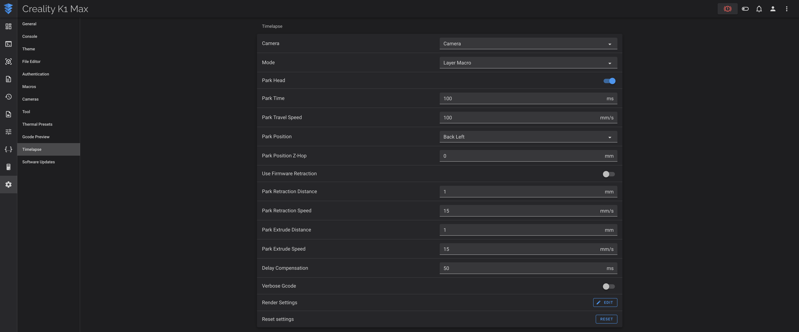

This allows you to use official Moonraker Timelapse features and install a version compatible with the K1 series.

More info about Moonraker Timelapse here: :material-github: [GitHub](https://github.com/mainsail-crew/moonraker-timelapse)

!!! Note
    **This procedure must be repeated after restoring the printer to factory settings.**

## Installation

- Make sure you have followed this <a href="../../helper-script/helper-script-installation">Install Helper Script</a> section before.

- In the script, enter in `[Install] Menu` by typing ++"1"++ , validate with ++"Enter"++ and install `Moonraker Timelapse`:

    

## Configuration

- You can now configure Timelapse settings:

  - On original Fluidd Web Interface go to `Settings` icon on the left side then to `Timelapse`.
  - On original Mainsail Web Interface go to `Settings` on the top right corner then to `Timelapse`.

    

- Your Slicer must be configured too, see this to configure it: :material-github: [GitHub](https://github.com/mainsail-crew/moonraker-timelapse/blob/main/docs/configuration.md#slicer-setup)

 

**If you like my work, don't hesitate to support me by paying me a 🍺 or a ☕. Thank you 🙂**

