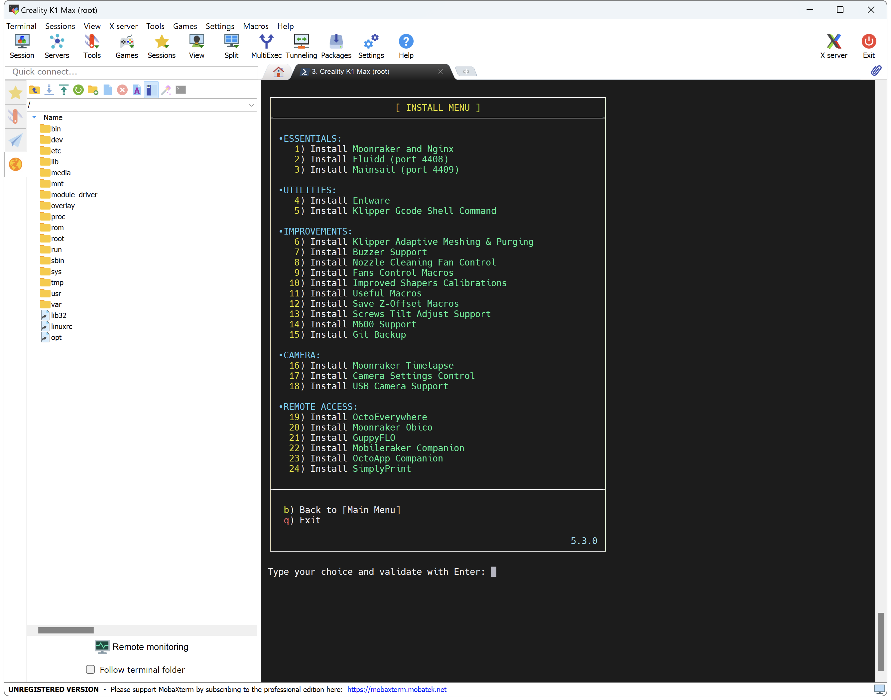

---
hide:
  - toc
---
Polar Cloud provides remote access and monitoring for your 3D printer. Connect to your printer from anywhere, manage print jobs, and access cloud-based slicing features.

More info about Polar Cloud: :material-web: [Here](https://polar3d.com/)

!!! Note
    **This procedure must be repeated after restoring the printer to factory settings.**

## Installation

- Make sure you have followed this <a href="../../helper-script/helper-script-installation">Install Helper Script</a> section before.

- In the script, enter in `[Install] Menu` by typing ++"1"++ , validate with ++"Enter"++ and install `Polar Cloud`:

    

 

**If you like my work, don't hesitate to support me by paying me a 🍺 or a ☕. Thank you 🙂**

