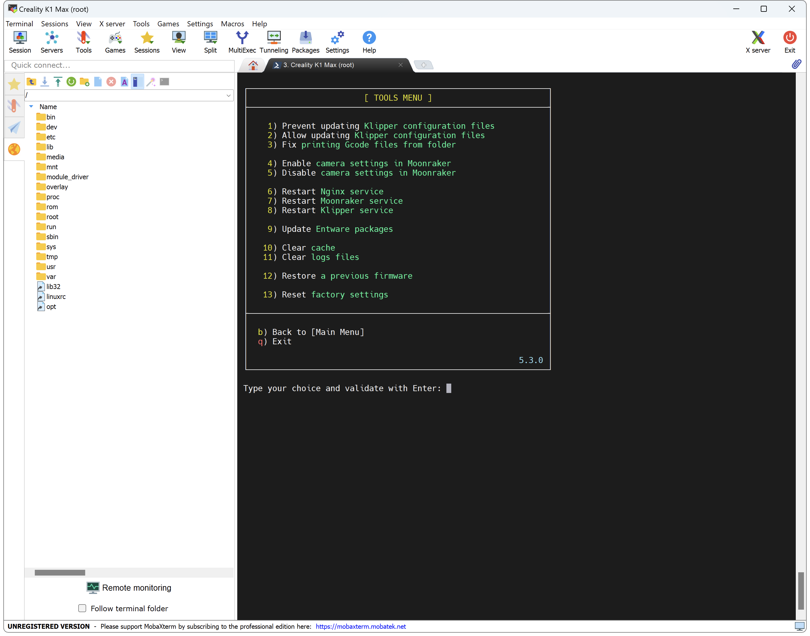

You can easily restore current Firmware to a previous Firmware directly from the Helper Script.

## Download Links

!!! Note
    Firmwares are official from Creality and work on K1, K1C and K1 Max, detection of the correct printer is done by the firmware. You can also download them from :material-web: [Creality Cloud](https://www.crealitycloud.com/software-firmware/firmware/flagship-series).

&nbsp;&nbsp;&nbsp;&nbsp;:material-google-drive: [1.3.2.1 (Google Drive)](https://drive.google.com/file/d/1-hD7gfqsY3cuEoSbo1h7D2EJTM5Njihk/view?usp=share_link) / :material-github: [1.3.2.1 (Creality GitHub)](https://github.com/CrealityOfficial/K1_Series_Klipper/releases/download/V1.3.2.20/CR4CU220812S11_ota_img_V1.3.2.20.img) / :material-note-text: [Changelog](https://raw.githubusercontent.com/Guilouz/Creality-Helper-Script-Wiki/main/downloads/Changelogs/K1/Changelog_1.3.2.1.txt)

&nbsp;&nbsp;&nbsp;&nbsp;:material-google-drive: [1.3.2.20 (Google Drive)](https://drive.google.com/file/d/1mF6DnCHkyZdrIkQ2ulALZ4DfufMfyjOo/view?usp=drive_link) / :material-note-text: [Changelog](https://raw.githubusercontent.com/Guilouz/Creality-Helper-Script-Wiki/main/downloads/Changelogs/K1/Changelog_1.3.2.20.txt) / :material-file-image: <a href="https://raw.githubusercontent.com/Guilouz/Creality-Helper-Script-Wiki/main/downloads/Changelogs/K1/Changelog_1.3.2.20.jpg">Picture</a>

&nbsp;&nbsp;&nbsp;&nbsp;:material-google-drive: [1.3.2.31 (Google Drive)](https://drive.google.com/file/d/1xMQhyEXoyxa391CLC5SOxUdxoA-4mFzV/view?usp=drive_link) / :material-note-text: [Changelog](https://raw.githubusercontent.com/Guilouz/Creality-Helper-Script-Wiki/main/downloads/Changelogs/K1/Changelog_1.3.2.31.txt)

&nbsp;&nbsp;&nbsp;&nbsp;:material-google-drive: [1.3.3.5 (Google Drive)](https://drive.google.com/file/d/1T0TvtmtD22mEpzL5YJzbyJ7H-9QIoozB/view?usp=drive_link) / :material-note-text: [Changelog](https://raw.githubusercontent.com/Guilouz/Creality-Helper-Script-Wiki/main/downloads/Changelogs/K1/Changelog_1.3.3.5.txt) / :material-file-image: <a href="https://raw.githubusercontent.com/Guilouz/Creality-Helper-Script-Wiki/main/downloads/Changelogs/K1/Changelog_1.3.3.5.jpg">Picture</a>

&nbsp;&nbsp;&nbsp;&nbsp;:material-google-drive: [1.3.3.8 (Google Drive)](https://drive.google.com/file/d/1Kh8oaVWUtEd0saeWahEs4Y5dTcPnKPrV/view?usp=drive_link) / :material-note-text: [Changelog](https://raw.githubusercontent.com/Guilouz/Creality-Helper-Script-Wiki/main/downloads/Changelogs/K1/Changelog_1.3.3.8.txt)

## Prepare USB drive

- Insert USB drive in your computer.

- You need to format it in FAT32 with 4096 allocation size (or exFAT on some USB drives).

- Copy `.img` firmware file you want to restore to the root of your USB drive and remove it from your computer.

    !!! Warning
        **Make sure there is no other file present on the USB drive except the firmware file.**

## Restoration

- Turn on the printer.

- When you are on home screen, plug USB drive on the front of the printer.

- Make sure you have followed this <a href="../../helper-script/helper-script-installation">Install Helper Script</a> section before.

- Start Helper Script and enter in `[Tools] Menu` by typing ++"5"++ , validate with ++"Enter"++ and select `Restore a previous firmware`:

    

- Then confirm the restoration.

- You should see the progress status in the console.

- When the process is complete, just turn off the printer and turn it back on to boot into the new firmware.

- Then, follow this <a href="../../firmwares/reset-factory-settings">Reset Factory Settings</a> section to restore default settings.

 

**If you like my work, don't hesitate to support me by paying me a 🍺 or a ☕. Thank you 🙂**

