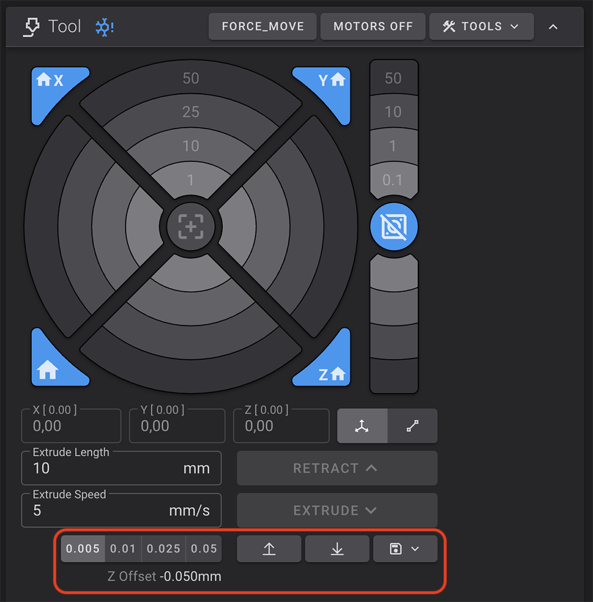
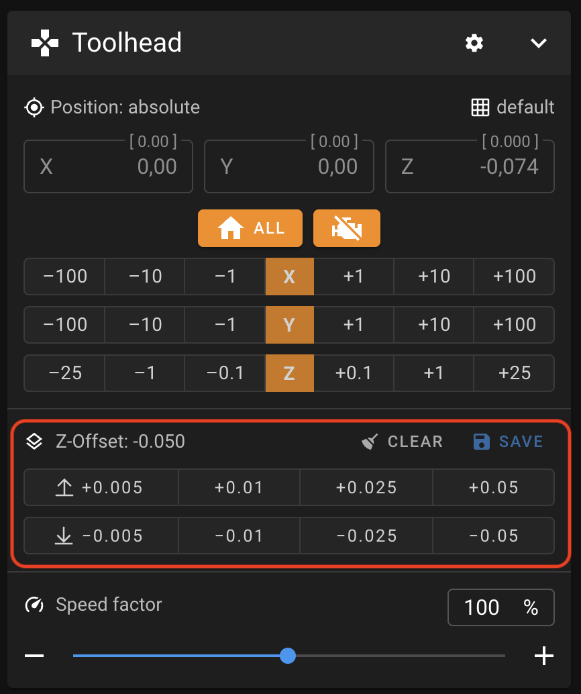
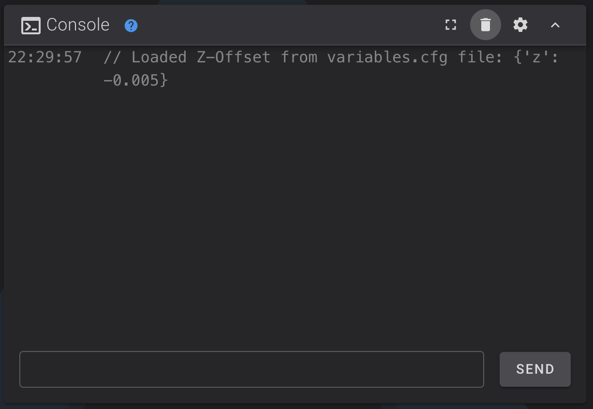
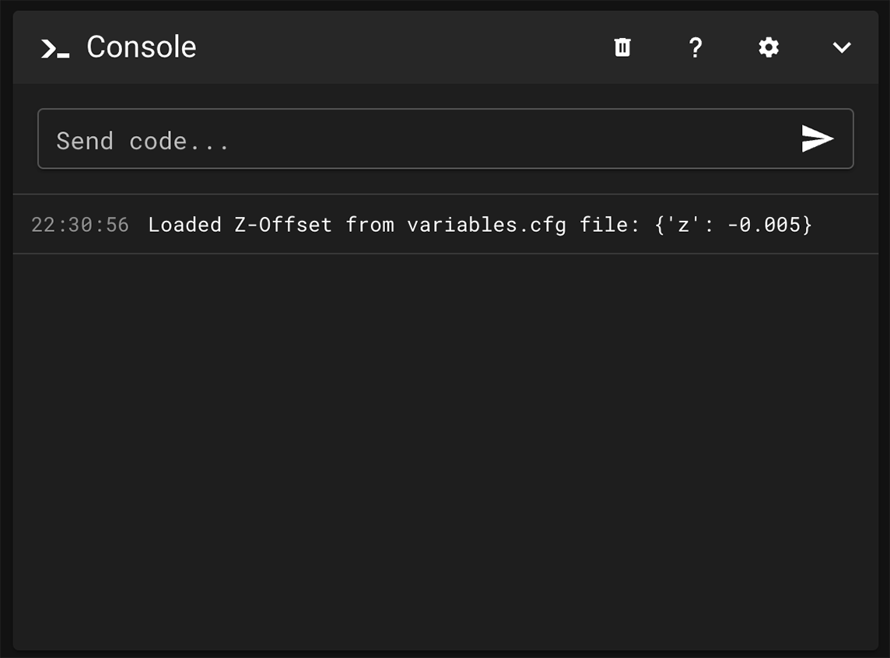

---
hide:
  - toc
---
This allows Z-Offset to be automatically saved and loaded.

!!! Note
    **This procedure must be repeated after restoring the printer to factory settings.**

## Installation

- Make sure you have followed this <a href="../../helper-script/helper-script-installation">Helper Script Installation</a> section before.

- In the script, enter in `[Install] Menu` by typing ++"1"++ , validate with ++"Enter"++ and install `Save Z-Offset Macros`:

    

- Once installed, you do not need to save the Z-Offset after adjustment:

    | Fluidd | Mainsail |
    | :---------: | :---------: |
    |  |  |

- Each time you use the Z-Offset function, it will be automatically saved in the `variables.cfg` file and loaded when Klipper starts:

    | Fluidd | Mainsail |
    | :---------: | :---------: |
    |  |  |

 

**If you like my work, don't hesitate to support me by paying me a 🍺 or a ☕. Thank you 🙂**

