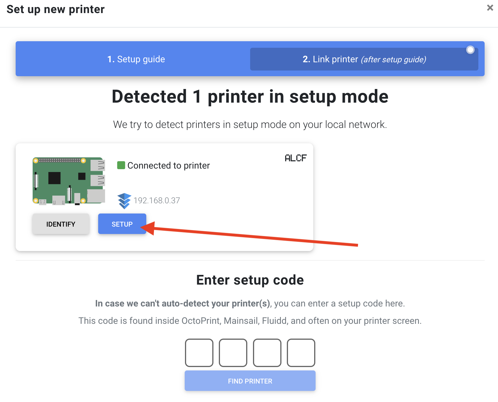
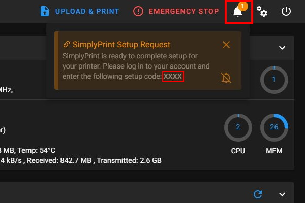
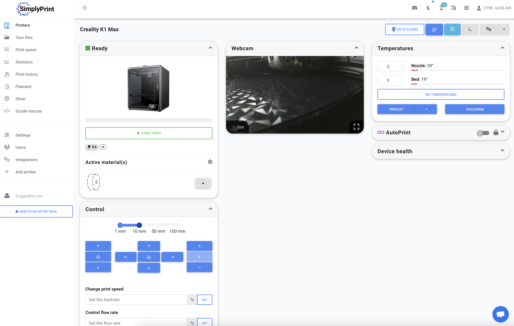

SimplyPrint allows you to start those prints that you just need to be done sooner rather than later. You can send print jobs to your printer from anywhere in the world.

More info about SimplyPrint: :material-web: [Here](https://simplyprint.io?utm_source=k1/ke-helper-script)

!!! Note
    **This procedure must be repeated after restoring the printer to factory settings.**

## Installation

- Make sure you have followed this <a href="../../helper-script/helper-script-installation">Install Helper Script</a> section before.

- In the script, enter in `[Install] Menu` by typing ++"1"++ , validate with ++"Enter"++ and install `SimplyPrint`:

    

## Download SimplyPrint

&nbsp;&nbsp;&nbsp;&nbsp;&nbsp;&nbsp;&nbsp;&nbsp;

## Configuration

- Create an account on SimplyPrint website: :material-web: [Sign up](https://simplyprint.io/panel/signup?utm_source=lp_nav?utm_source=k1/ke-helper-script)

-  Click on `Add your first printer`:

    

- Then, click on `2. Link printer (after setup guide)`:

    

- At this stage, your printer should be automatically detected, click on `SETUP` button and select the correct printer you use:

    

- If it's not the case, access to your Fluidd or Mainsail Web Interface.
  
- In the **Announcements** bell in the top bar, find the `SimplyPrint Setup Request` message and copy the setup code:

  | Fluidd | Mainsail |
  | :---------: | :---------: |
  |  |  |

- Then, enter this code here:

    

- You have now access to SimplyPrint interface:

    

- See how to integrate SimplyPrint to OrcaSlicer: :material-web: [Here](https://help.simplyprint.io/en/article/the-orcaslicer-simplyprint-integration-how-to-set-up-and-use-1miu532/)

 

**If you like my work, don't hesitate to support me by paying me a 🍺 or a ☕. Thank you 🙂**

