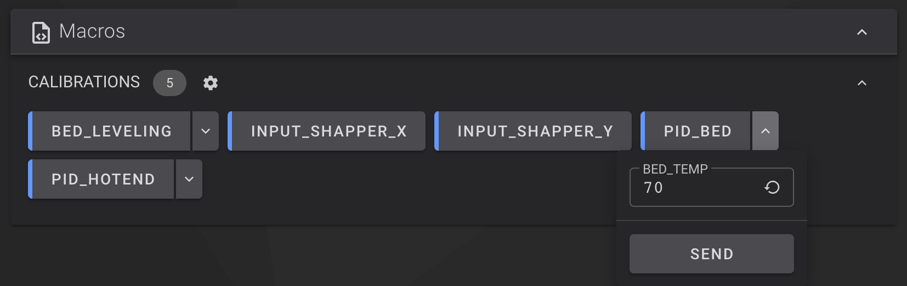
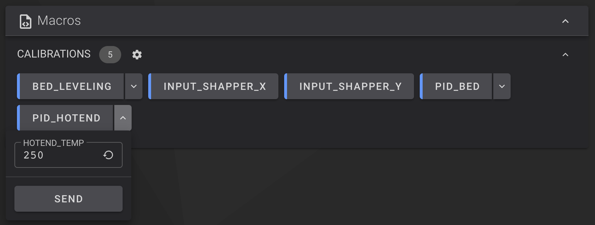

---
hide:
  - toc
---
This allows to install useful macros.

!!! Note
    **This procedure must be repeated after restoring the printer to factory settings.**

## Installation

- Make sure you have followed this <a href="../../helper-script/helper-script-installation">Helper Script Installation</a> section before.

- In the script, enter in `[Install] Menu` by typing ++"1"++ , validate with ++"Enter"++ and install `Useful Macros`:

    

- You can perform Bed PID calibration with `PID_BED` macro by selecting Bed temperature you want for:

    

- You can perform Hotend PID calibration with `PID_HOTEND` macro by selecting Hotend temperature you want for:

    

- You can perform Bed Leveling with `BED_LEVELING` macro and define some parameters like Hotend and Bed temperatures or Probe count:

    

- You can perform a Stress Test with `WARMUP` macro to move the hotend at a defined acceleration with the aim of "warming up" the bearings and rods in order to achieve better movements of the axes and increase the maximum acceleration values. You can define some parameters like numbers of loops, maximum acceleration of X and Y axis:

    

- You can perform `LUBRICATE_RODS` macro to move the hotend along the X and Y axis to spread grease or oil when lubricating the axes.

- You can perform `KLIPPER_BACKUP_CONFIG` macro to backup Klipper configuration files. File `backup_config.tar.gz` is saved in your printer's configuration folder.

- You can perform `KLIPPER_RESTORE_CONFIG` macro to restore Klipper configuration files using `backup_config.tar.gz` file.

- You can perform `MOONRAKER_BACKUP_DATABASE` macro to backup Moonraker database. File `backup_database.tar.gz` is saved in your printer's configuration folder.

- You can perform `MOONRAKER_RESTORE_DATABASE` macro to restore Moonraker database using `backup_database.tar.gz` file.

 

**If you like my work, don't hesitate to support me by paying me a 🍺 or a ☕. Thank you 🙂**

