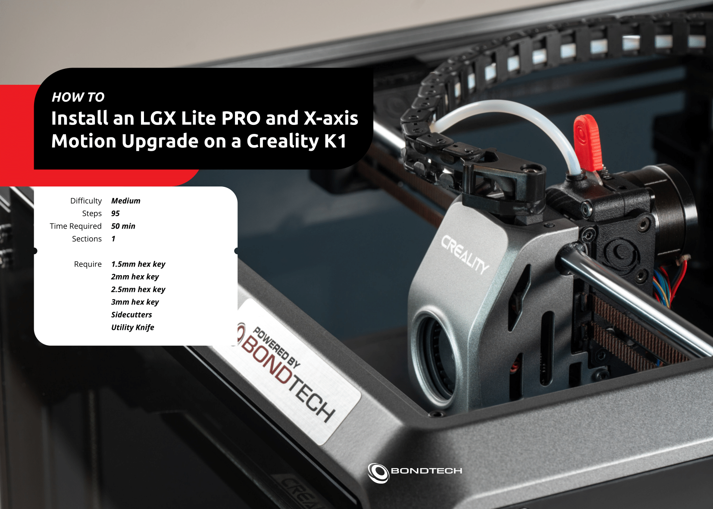
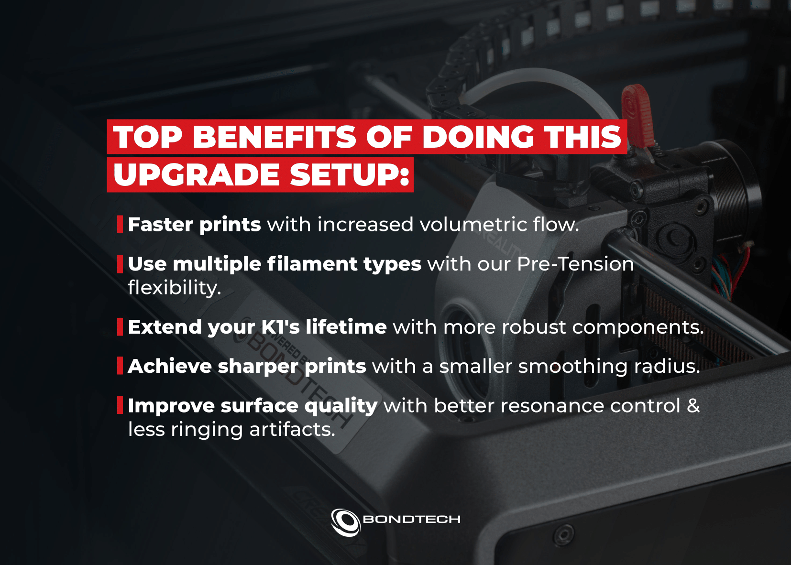
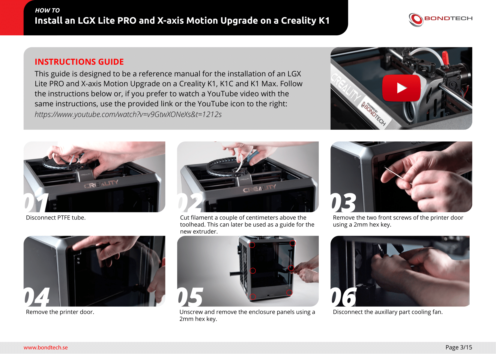
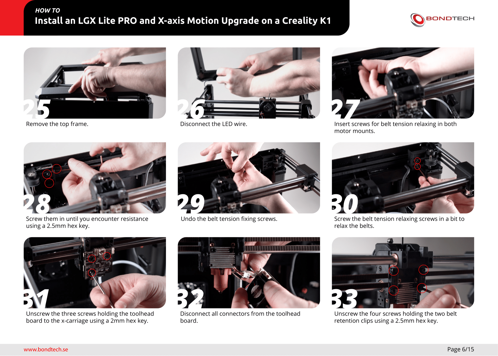
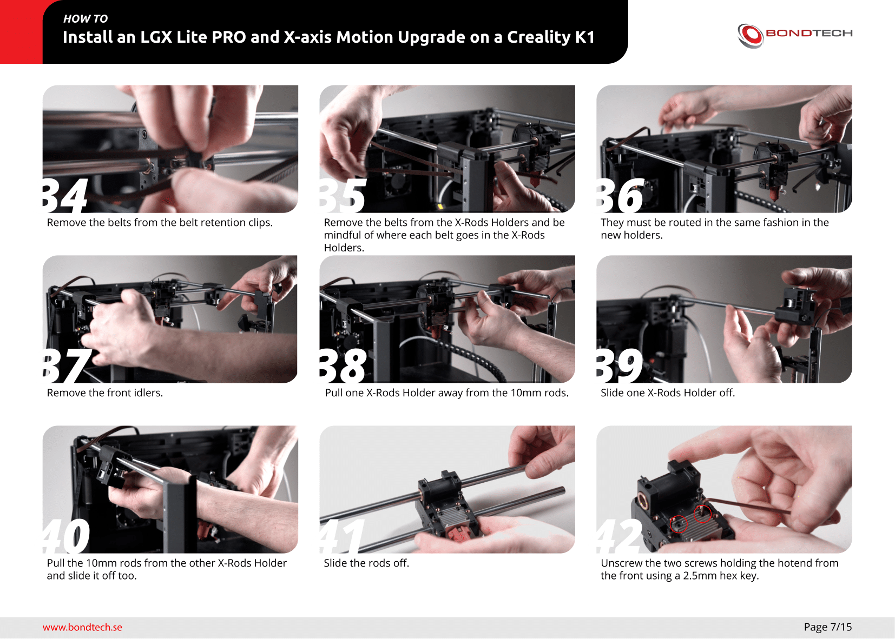
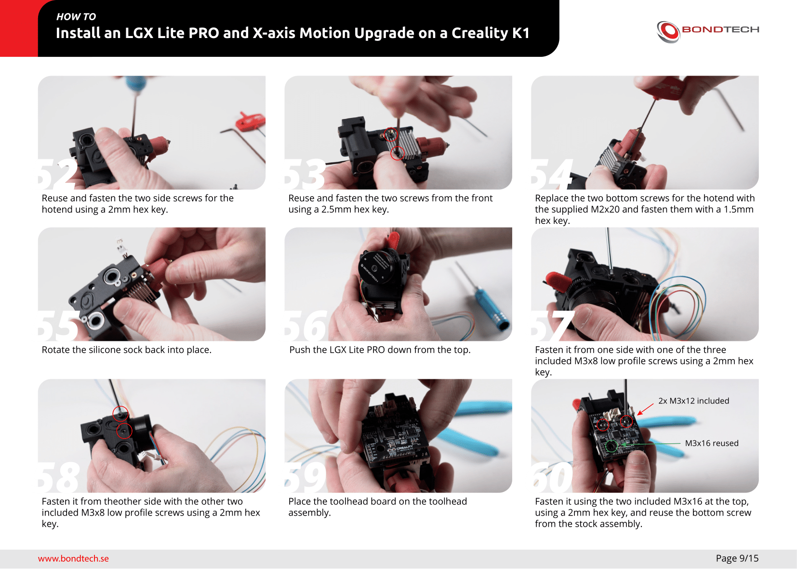
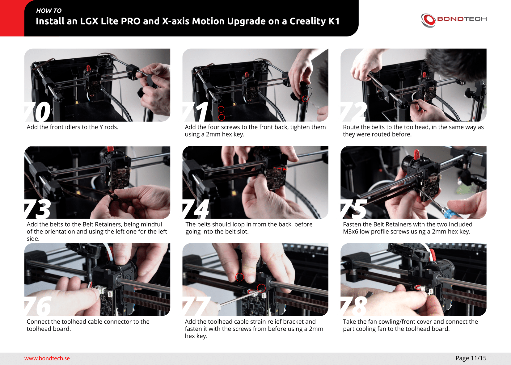
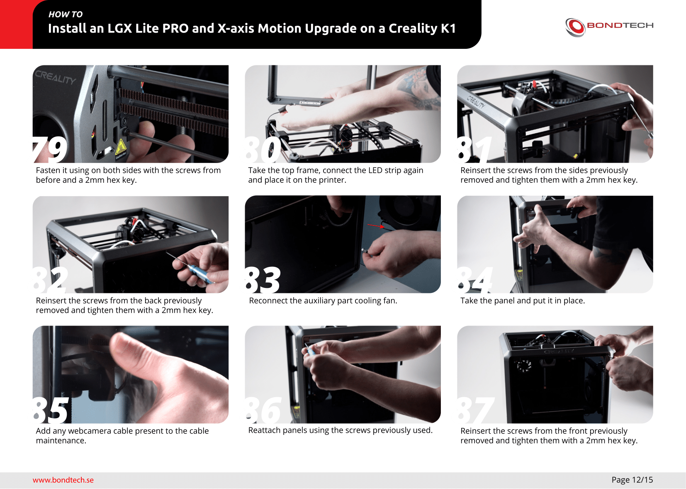
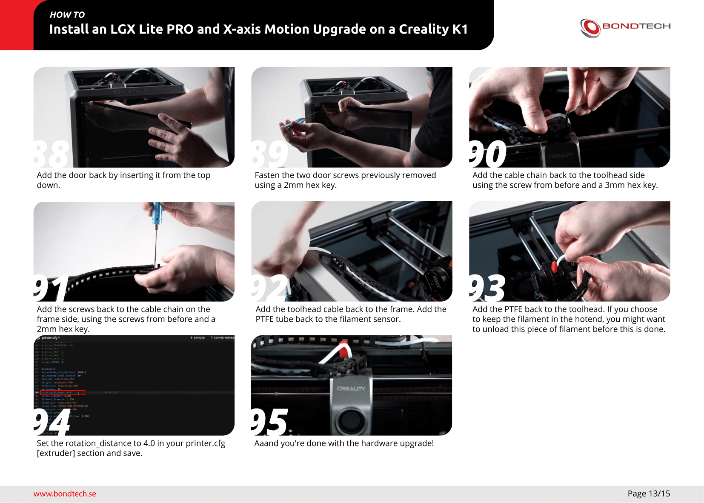
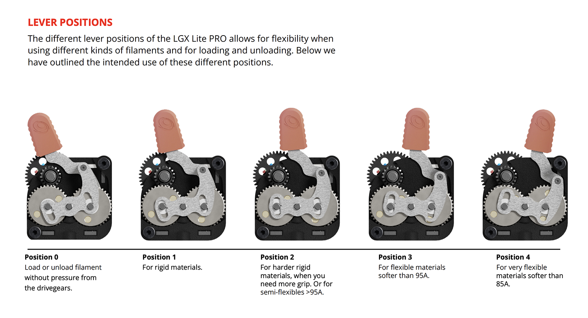

Is your Creality K1 Max falling short? You have a way to make it much better. Improve speed, surface quality, versatility and durability.<br />
This XY-axis and Large Gears Extruder LGX Lite Pro upgrade from **Bondtech** is designed to use on the Creality K1, K1C and K1 Max.


## Links
<hr>

&nbsp;&nbsp;&nbsp;&nbsp;:material-web: <a href="For K1/K1C: https://www.bondtech.se/product/lgx-lite-pro-upgrade-kit-for-creality-k1-k1c/">LGX Lite Pro Upgrade Kit for Creality K1 and K1C</a><br />
&nbsp;&nbsp;&nbsp;&nbsp;:material-web: <a href="https://www.bondtech.se/product/lgx-lite-pro-upgrade-kit-for-creality-k1-max/">LGX Lite Pro Upgrade Kit for Creality K1 Max</a>


## Installation
<hr>























## Klipper Configuration
<hr>

It’s needed to change extruder motor configuration.

- Open `printer.cfg` file:

    - On original Fluidd Web Interface go to `Configuration` icon on the left side.
    - On original Mainsail Web Interface go to `Machine` tab on the left side.

- Search section named `[extruder]` and replace this parameter:

    ``` title="printer.cfg" hl_lines="2"
    [extruder]
    rotation_distance: 3.99
    ```

- Search section named `[tmc2209 extruder]` and replace this parameter:

    ``` title="printer.cfg" hl_lines="2"
    [extruder]
    run_current: 0.6
    ```


## Slicer Configuration
<hr>

It’s needed to change retraction settings in your slicer:

- **For 0.4mm nozzle:** 0.7mm length @ 35mm/s
- **For 0.4mm nozzle:** 0.9mm length @ 35mm/s


## Use
<hr>



<br />

**If you like my work, don't hesitate to support me by paying me a 🍺 or a ☕. Thank you 🙂**

<a href="https://ko-fi.com/guilouz" target="_blank"></a>
