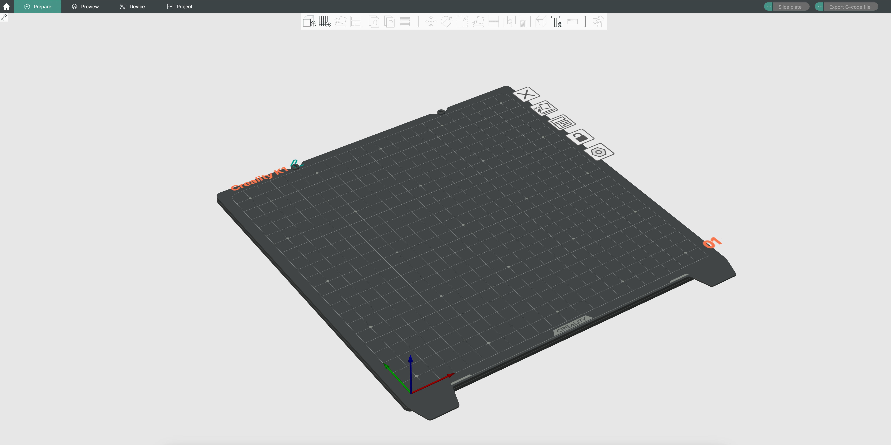
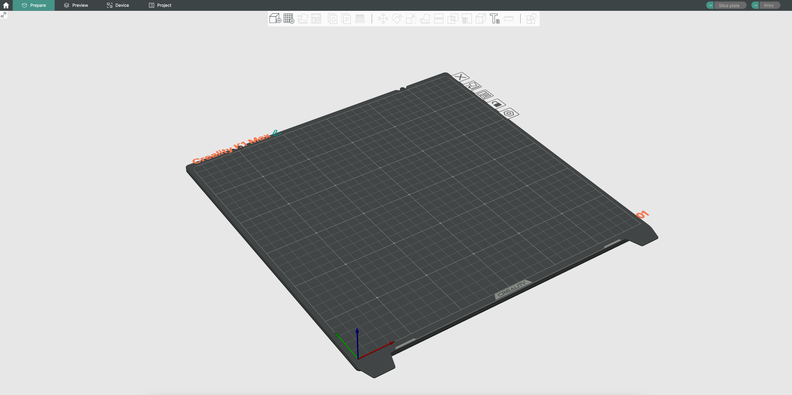
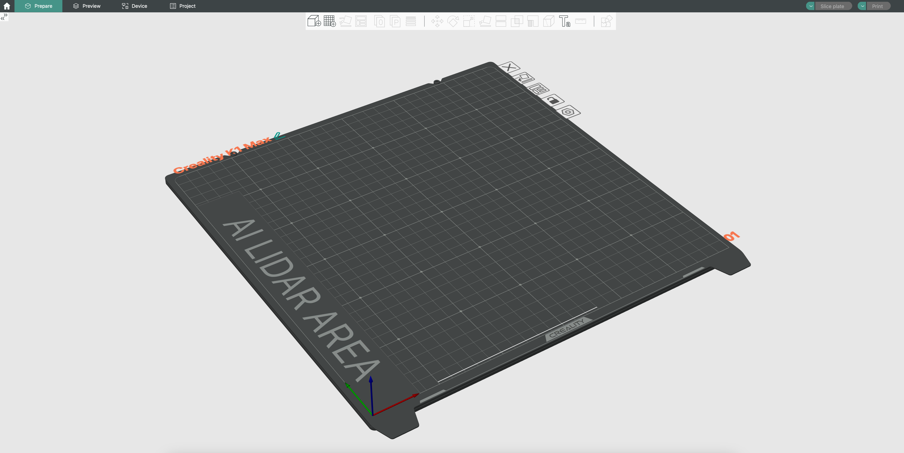
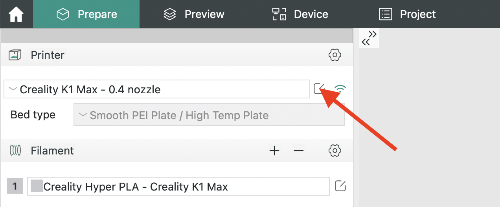
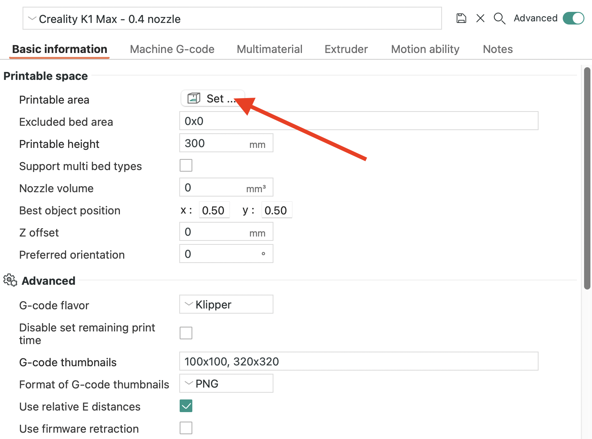
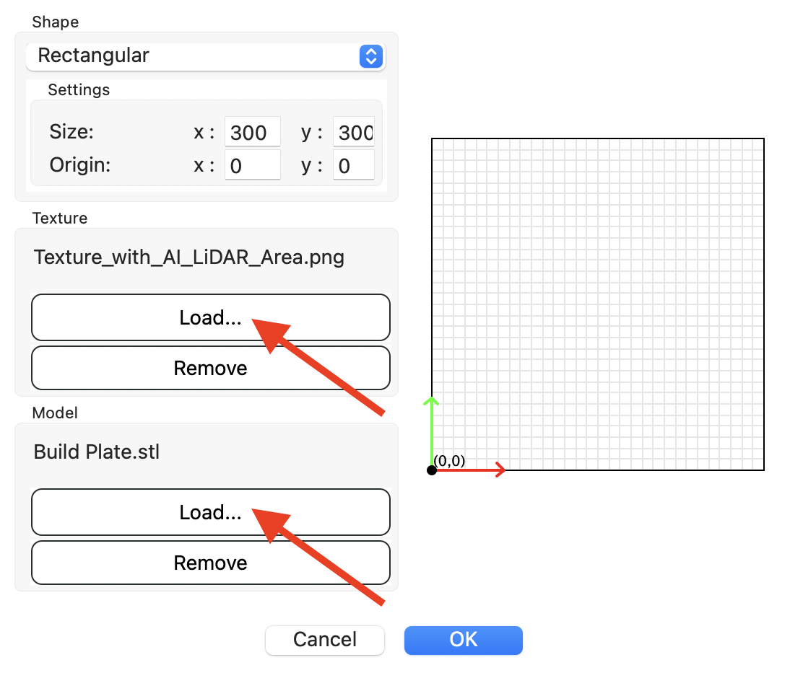
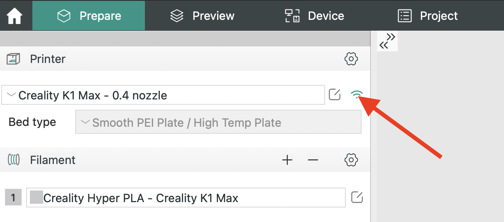
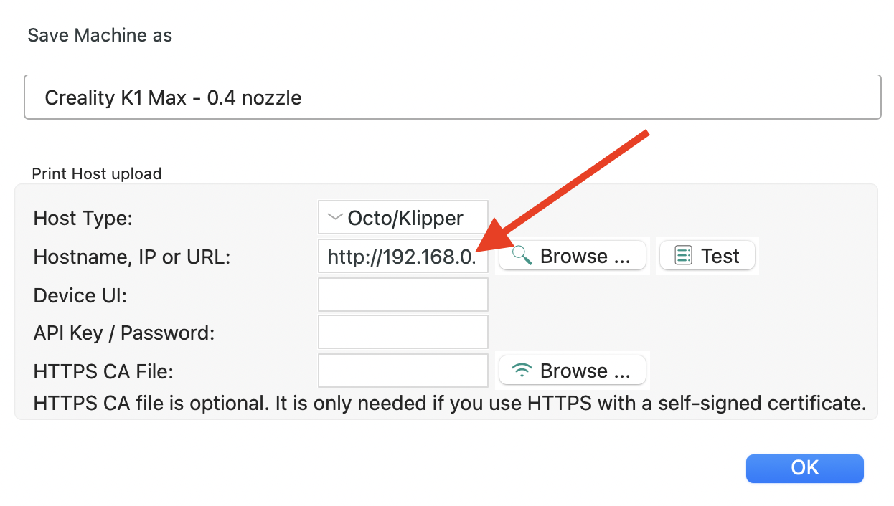

OrcaSlicer is an open source slicer for FDM printers.

You can download it here: [GitHub](https://github.com/SoftFever/OrcaSlicer/releases/latest)


Here you will find custom build plates for OrcaSlicer:

| Creality K1/K1C |
| :---------: |
|  |

| Creality K1 Max without LiDAR Area |
| :---------: |
|  |

| Creality K1 Max with LiDAR Area |
| :---------: |
|  |


## Download Links
<hr>

:material-download: [Custom Build Plates for K1](https://github.com/Guilouz/Creality-Helper-Script-Wiki/raw/main/downloads/OrcaSlicer/Creality_K1.zip)

:material-download: [Custom Build Plates for K1 Max](https://github.com/Guilouz/Creality-Helper-Script-Wiki/raw/main/downloads/OrcaSlicer/Creality_K1_Max.zip)


## Installation
<hr>

- Unzip downloaded file.

- Start **OrcaSlicer** and click on the icon for editing printer presets:

    

- Click on `Set...` button in `Printable area` section:

    

- Load the PNG file (the one you want) in the `Texture` box and the file `Build_Plate.stl` in the `Model` box by clicking on `Load...` button:

    

- Then save your printer profile.


## Configure Machine G-codes
<hr>

- Start **OrcaSlicer** and click on the icon for editing printer presets:

    

- Click on `Machine G-code` tab and define the following G-codes:

    ``` title="Machine start G-code"
    SET_PRINT_STATS_INFO TOTAL_LAYER=[total_layer_count]
    M140 S0
    M104 S0
    START_PRINT EXTRUDER_TEMP=[nozzle_temperature_initial_layer] BED_TEMP=[bed_temperature_initial_layer_single]
    ```

    ``` title="Machine end G-code"
    END_PRINT
    ```

    ``` title="Before layer change G-code"
    ;BEFORE_LAYER_CHANGE
    ;[layer_z]
    G92 E0
    ```

    ``` title="Layer change G-code"
    SET_PRINT_STATS_INFO CURRENT_LAYER={layer_num + 1}
    ;AFTER_LAYER_CHANGE
    ;[layer_z]
    ```

    ``` title="Layer change G-code"
    SET_PRINT_STATS_INFO CURRENT_LAYER={layer_num + 1}
    ;AFTER_LAYER_CHANGE
    ;[layer_z]
    ```
    
    ``` title="Time lapse G-code (if you use Timelapse)"
    TIMELAPSE_TAKE_FRAME
    ```

    ``` title="Change filament G-code (if you use M600 Support feature otherwise it must be PAUSE)"
    M600
    ```

    ``` title="Pause G-code (if you use M600 Support feature otherwise it must be PAUSE)"
    M600
    ```


## Upload Gcode files to printer
<hr>

- In **OrcaSlicer**, click on `Connexion` icon:

    

- In `Hostname, IP or URL` section, enter the IP address of your printer depending Web interface you are using:

    - For **Fluidd**: http://xxx.xxx.xxx.xxx:4408/ (replacing xxx.xxx.xxx.xxx by your local IP address)
    - For **Mainsail**: http://xxx.xxx.xxx.xxx:4409/ (replacing xxx.xxx.xxx.xxx by your local IP address)
    - If you have removed **Creality Web Interface**: http://xxx.xxx.xxx.xxx/ (replacing xxx.xxx.xxx.xxx by your local IP address)

    

- You can now upload Gcode files to your printer.

<br />

**If you like my work, don't hesitate to support me by paying me a 🍺 or a ☕. Thank you 🙂**

<a href="https://ko-fi.com/guilouz" target="_blank"></a>
